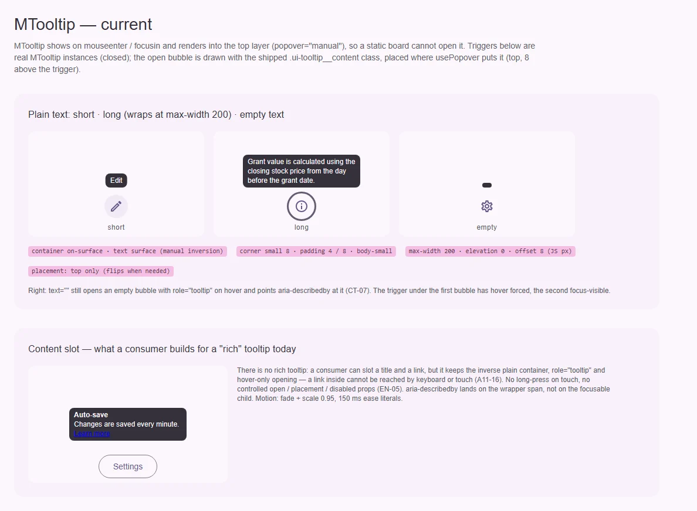
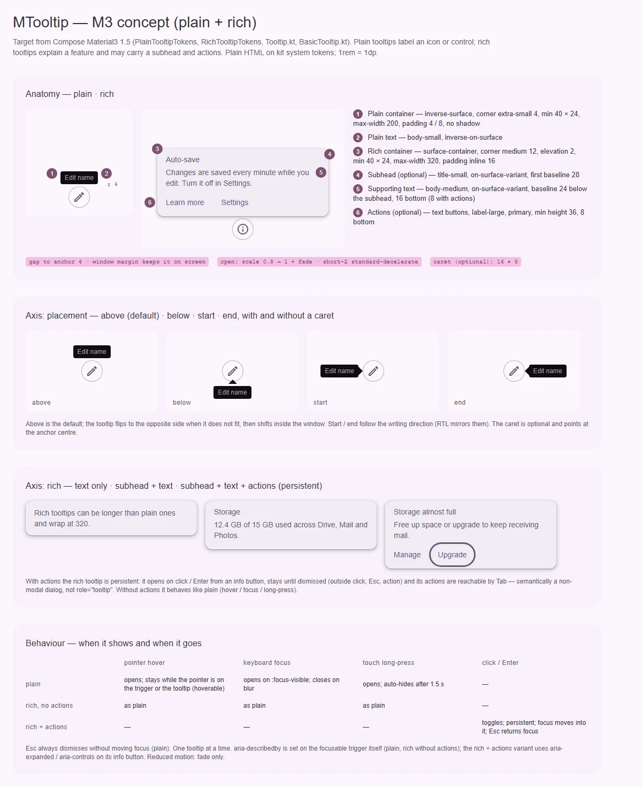

# MTooltip — подсказка у элемента (plain); rich tooltip — gap

<identity>M3: Tooltips — plain и rich (с subhead и действиями, persistent) · Токены Compose: `PlainTooltipTokens.kt`, `RichTooltipTokens.kt`; поведение — `Tooltip.kt` (`TooltipBox`, `PlainTooltip`, `RichTooltip`, `TooltipDefaults`), `internal/BasicTooltip.kt` (`TooltipDuration`) · Код: `src/runtime/components/ui/tooltip/`, позиционирование — `src/runtime/composables/popover/usePopover.ts`, токены `src/runtime/assets/stylesheet/components/tooltip/_index.scss` · Аудит: `data/tooltip.json` · Тип: public</identity>

<implementation-status state="planned" updated="2026-10-07">План новый. Тултип уже переведён на `usePopover` и top layer (`popover="manual"`), он hoverable (грейс 100 мс, WCAG 1.4.13) и закрывается по Esc. Шаги 1–4 не ломают API и могут идти сразу; rich и касание ждут вопросов 1–3.</implementation-status>

## Вердикт

`дрейф` для plain и `нет в ките` для rich. Plain узнаётся как M3: инверсная плашка
`body-small`, ширина до 200, padding 4 / 8, без тени. Разошлись роль и геометрия. Инверсия
собрана вручную из `on-surface` / `surface`, а не из ролей `inverse-surface` /
`inverse-on-surface`; угол 8 вместо 4; до якоря 8 вместо 4, и в JS это 8 px, а не 8 rem. Главные
дефекты — доступность: `aria-describedby` висит на служебном `span`, а не на фокусируемом элементе,
поэтому скринридер описание не читает; на тач-экране тултип не открыть; пустой `text` рисует пустой
пузырь. Rich tooltip (subhead, текст, действия) нет. Управляемого режима, `placement` и `disabled`
нет.

## Рендеры

| Сейчас | Концепт M3 |
|---|---|
|  |  |

**Сейчас.** Тултип открывается по `mouseenter` / `focusin` в top layer, статично его не открыть.
Триггеры на доске — настоящие закрытые `MTooltip`. Пузырь нарисован поставляемым классом
`.ui-tooltip__content` там, куда его ставит `usePopover`: сверху, в 8 над триггером.
1. Короткий текст, длинный (перенос на 200) и `text=""`: пустой пузырь с `role="tooltip"`
   (CT-07). На первом триггере принудительный hover, на втором — focus-visible.
2. Слот `#content` — то, что потребитель собирает вместо rich: заголовок и ссылка в инверсной
   плашке, которые нельзя достать ни клавиатурой, ни касанием (A11-16).

**Концепт.**
1. Анатомия plain (2 части) и rich (4 части) с выносками, зазор до якоря 4.
2. Ось размещения: above (по умолчанию), below, start, end, с хвостиком и без.
3. Ось rich: только текст; subhead + текст; subhead + текст + действия (persistent).
4. Поведение: таблица «что открывает и что закрывает» для plain, rich без действий и rich с
   действиями по указателю, фокусу, долгому нажатию и клику.

## Анатомия

| # | Часть M3 | Элемент кита | Статус |
|---|---|---|---|
| 1 | Plain container | `.ui-tooltip__content` (`index.vue:125`) | иначе: `on-surface`, угол `small` 8, без min 40 × 24 |
| 2 | Plain supporting text | `text` / слот `#content` | иначе: `surface` вместо `inverse-on-surface`; слот пускает интерактив |
| 3 | Rich container | — | нет |
| 4 | Rich subhead | — | нет |
| 5 | Rich supporting text | — | нет |
| 6 | Rich actions | — | нет |
| — | Caret (опционально, 16 × 8) | — | нет (вне объёма) |
| — | Триггер (якорь) | `.ui-tooltip__trigger` (`span`) вокруг слота | есть; `aria-describedby` ставится на этот `span` (`index.vue:13`) |

## Оси дизайна

| Ось | M3 | Кит сейчас | Цель | Ломает API |
|---|---|---|---|---|
| Вид | plain · rich | только plain | plain + rich, вопросы 1–2 | нет, добавление |
| Размещение | above (по умолчанию) · below · start · end; переворот и сдвиг | `placement: 'top'` зашит (`index.vue:70`), переворот есть | проп `placement` (логические стороны по menu.md, шаг 2) | нет |
| Хвостик (caret) | опционален | нет | вне объёма (В4) | — |
| Rich: состав | текст · subhead + текст · + действия | — | по вопросу 1 | нет |

## Оси состояний

Из `axes` аудита, сверено с кодом.

| Ось | Нужно | Есть | Не хватает |
|---|---|---|---|
| Базовое | скрыт / показан, выключен | `v-if` по `visible` | `disabled`; пустой текст не открывает (CT-07) |
| Взаимодействие | hover на триггере и на тултипе | да, грейс 100 мс | долгое нажатие на таче (вопрос 3) |
| Фокус | показ на фокусе с клавиатуры, скрытие на blur | `focusin` / `focusout` на обёртке, без проверки `:focus-visible` | показ только при `:focus-visible` |
| Раскрытие | open / closed, управляемо снаружи | только внутреннее состояние | `v-model:open` (EN-05) |
| Выбор, навигация, смысловое, валидация, данные | — | — | не применимо |

## Токены: расхождения

Карта — `assets/stylesheet/components/tooltip/_index.scss`, пути `g()` уже точечные.

| Часть | M3 (Compose) | Кит сейчас (`файл` / путь `g()`) | Действие |
|---|---|---|---|
| Контейнер plain | `PlainTooltipTokens.ContainerColor` = `inverse-surface` | `content.bg.color` = `on-surface` (`_index.scss:18`) | → `inverse-surface` (TH-01, правило пар) |
| Текст plain | `SupportingTextColor` = `inverse-on-surface` | `content.color` = `surface` (`_index.scss:20`) | → `inverse-on-surface` |
| Форма plain | `ContainerShape` = `CornerExtraSmall` 4 | `content.border.radius` = `small` 8 (`_index.scss:15`) | → `extra-small` |
| Минимум | `TooltipMinWidth` 40, `TooltipMinHeight` 24 | нет | `min-inline-size: 40rem`, `min-block-size: 24rem` |
| Зазор до якоря | `SpacingBetweenTooltipAndAnchor` = 4 | `content.offset: 8rem` (`_index.scss:10`) и `TOOLTIP_OFFSET = 8` в px (`index.vue:60`, TK-07) | 4, один источник: см. «Поведение» |
| Анимация | scale 0.8 → 1 (FastSpatial) + alpha (FastEffects) | fade + `scale(0.95)`, `0.15s ease` литералами (`index.vue:150-158`, TK-04, MO-05) | `--sys-motion-duration-short-2` + `standard-decelerate` / `short-1` + `standard-accelerate`, scale 0.8; пружин нет (S4 отклонён владельцем 2026-10-07); reduced motion — только fade |
| Rich container | `RichTooltipTokens.ContainerColor` = `surface-container`, `ContainerShape` = `medium` 12, `ContainerElevation` = Level 2, `richTooltipMaxWidth` 320, padding по строке 16 | — | ветка `rich.*` |
| Rich subhead | `SubheadFont` = `title-small`, `SubheadColor` = `on-surface-variant`, первая базовая линия 28 | — | добавить |
| Rich text | `SupportingTextFont` = `body-medium`, `on-surface-variant`, базовая линия 24 от subhead, снизу 16 (8 с действиями) | — | добавить |
| Rich actions | `ActionLabelTextFont` = `label-large`, `primary`, min 36, снизу 8 | — | `MButton variant="text"` |
| Caret | `caretSize` 16 × 8 | — | вне объёма |

Совпадает: шрифт `body-small`, max-width 200 (`plainTooltipMaxWidth`), padding 4 / 8
(`PlainTooltipVerticalPadding` / `HorizontalPadding`), тень plain 0, рамка `CanvasText` в forced
colors (`index.vue:144`, TH-04 уже исправлен).

## Поведение и доступность

- **Описание на фокусируемом элементе (A11-16).** Сейчас `aria-describedby` стоит на
  `span.ui-tooltip__trigger` (`index.vue:13`), а фокус получает кнопка из слота: описание не
  объявляется. Как доставить атрибут до нужного элемента — вопрос 4. Вторая проблема — гонка:
  связь и сам узел появляются в момент `focusin` (`v-if`), и скринридер может прочитать кнопку
  раньше. Узел, на который прямо указывает `aria-describedby`, участвует в описании и скрытым,
  поэтому текст описания держится в DOM всегда (визуально скрытый `span` рядом с триггером, уже в
  SSR), а пузырь в top layer остаётся визуальной копией с `aria-hidden="true"`. Для rich без действий — то же самое.
- **Пустой текст (CT-07).** Нет `text` и нет слота — `show()` ничего не делает, связь не ставится.
- **Фокус.** Показ только если триггер `:focus-visible`. Клик мышью по кнопке не должен
  оставлять тултип открытым после ухода указателя. Скрытие на `focusout` остаётся.
- **Esc.** Закрывает без перемещения фокуса, как сейчас. Слушатель `window keydown` вешается
  только пока тултип виден: сейчас `useGlobalListener` держит его у каждого экземпляра всегда
  (`index.vue:107`), та же болезнь, что EN-10 у меню.
- **Один за раз.** Как `MutatorMutex` в Compose: открытие нового тултипа закрывает предыдущий.
  Общий модульный «текущий тултип», без Pinia и без `useState` (состояние клиентское).
- **Касание.** Сегодня на тач-экране тултип не открыть (IN-02). M3: долгое нажатие показывает plain
  и прячет через 1,5 с (`BasicTooltipDefaults.TooltipDuration`). Вопрос 3.
- **Зазор.** Отступ живёт в одном месте — длина в rem на пропе или константе. Нативный путь
  `usePopover` ставит её в `margin` как есть (`4rem`), JS-путь переводит в px через вычисленный
  `font-size` корня (живая геометрия, `craft.md` §10). Токен `content.offset` удаляется: два дома
  одного значения — это TK-07.
- **Rich с действиями** (если выбран вариант 3 вопроса 1). Это уже не `role="tooltip"` (APG
  запрещает интерактив внутри), а немодальный диалог. Открывается кликом или Enter по
  info-кнопке, на триггере `aria-expanded` / `aria-controls`. Остаётся до явного закрытия (клик
  снаружи, Esc, действие); фокус переходит внутрь, Esc возвращает его на триггер. Строится на
  `usePopover` + `useClickOutside` + `useFocusTrap` без цикла.
- **Слот `#content`.** В документации — только текст и фразовая разметка. Интерактив — только в
  rich с действиями.
- **Движение (A11-18).** Reduced motion — fade без масштаба.
- **Позиционирование.** Переворот и сдвиг уже есть в `usePopover`. RTL и логические стороны
  приходят из [menu.md](menu.md), шаг 2. Литерал `z-index: 999` в `usePopover` уходит там же (долг 5
  menu.md).

## API

| Действие | Что | Ломает | Миграция |
|---|---|---|---|
| Добавить | `placement: PopoverPlacement` (по умолчанию `'top'`) | нет | — |
| Добавить | `v-model:open` (`defineModel('open')`) и `disabled` (EN-05) | нет | — |
| Добавить | ось вида plain / rich — вопрос 2; `subhead` + слот `#subhead`; слот `#actions` — по вопросу 1 | нет | — |
| Добавить | scoped-пропы слота по умолчанию `{ props }` с `aria-describedby` — по вопросу 4 | нет | — |
| Изменить | пустой текст не открывает тултип | нет (исправление) | — |
| Изменить | зазор 8 → 4, угол 8 → 4, роли `inverse-*` | нет (визуально) | — |
| Не трогать | `text`, слот `#content` | — | — |

## План работ

1. **S — токены и движение.** Роли `inverse-*`, угол `extra-small`, min 40 × 24, motion-токены,
   scale 0.8, reduced motion. Визуальное изменение: угол и (в брендовых схемах) тон плашки. Файлы:
   `assets/stylesheet/components/tooltip/_index.scss`, `components/ui/tooltip/index.vue`. После
   правки — `npm run lint:scss`.
2. **S — зазор из одного места.** Отступ `4rem` на пропе или константе; `usePopover` принимает CSS-длину,
   в JS-пути переводит её в px. Удалить `content.offset`. Файлы: `tooltip/index.vue`,
   `composables/popover/usePopover.ts`, `tooltip/_index.scss`.
3. **M — доступность.** `aria-describedby` на фокусируемом элементе (вопрос 4), постоянная связь,
   пустой текст, показ на `:focus-visible`, Esc-слушатель только у открытого, «один за раз». Файлы:
   `tooltip/index.vue`, новый `composables/tooltip/useTooltipControl.ts` (бэги `triggerAttrs`,
   `tooltipAttrs`, без классов и `data-*`, `behavior.md`).
4. **S — управляемость.** `placement`, `v-model:open`, `disabled`. Файлы: `tooltip/props.ts`,
   `tooltip/index.vue`.
5. **M — rich.** По вопросам 1–2: ветка токенов `rich.*`, subhead, разметка с базовыми линиями,
   действия (`MButton`). Если вариант 3 — режим «клик + persistent + немодальный диалог». Файлы:
   `tooltip/index.vue` (или `tooltip/rich/`, если SFC выходит за 400 строк), `tooltip/_index.scss`.
6. **S — касание.** По вопросу 3.
7. **M — документация (DC-02…05).** Анатомия и токены, когда plain и когда rich, запрет интерактива
   в plain, показ на фокусе, Esc, hoverable, переворот.

## Тесты

- **Фикстуры** `playground/fixtures/tooltip/`:
  - `matrix.vue`: plain / rich × {текст, subhead, действия} × `placement` × `disabled`, открытые
    через `v-model:open`;
  - `stress.vue`: длинное слово, 500 символов, пустой `text`, триггер в каждом углу окна, RTL,
    тултип внутри открытого `MDialog`.
- **e2e** (`tooltip.e2e.ts`, Playwright + axe):
  - axe с открытым тултипом;
  - описание объявлено на кнопке: `aria-describedby` указывает на узел с текстом, который есть в DOM
    ещё до фокуса;
  - Tab открывает, Esc закрывает без смены фокуса;
  - указатель переходит с триггера на тултип без закрытия;
  - один тултип за раз;
  - долгое нажатие (по вопросу 3) — эмуляция touch;
  - rich с действиями: Enter открывает, Tab внутрь, Esc возвращает фокус;
  - forced colors; reduced motion.
- **Unit**: `useTooltipControl` на анонимной разметке без `class` и `data-*`; пустой текст не
  открывает; `v-model:open`; `disabled`; JS-путь переводит `4rem` в px.

## Готово, когда

- Plain нарисован ролями `inverse-*`, угол 4, зазор 4 из одного места.
- Скринридер читает описание на фокусируемом элементе; пустой тултип не появляется.
- Есть `placement`, `v-model:open`, `disabled`; Esc-слушатель только у открытого.
- Решения по вопросам 1–4 реализованы; линтеры и e2e зелёные.

## Предложения по UX

Расширения сверх паритета с M3. Это предложения владельцу, а не шаги плана: в «План работ» попадают
только после решения. Без новых зависимостей, переходы — на `--sys-motion-*`. Общие для всех слоёв
предложения уже записаны в [overlay.md](overlay.md) («Предложения по UX»: кнопка
«назад» браузера закрывает слой `closeOnBack`, `beforeClose`-защита от потери ввода, `inert` фона) и
здесь не повторяются.

| Предложение | Что получает пользователь | Заказчик | Цена | Рекомендация |
|---|---|---|---|---|
| Задержка и «прогрев» группы: первый тултип через ~500 мс, следующие в течение ~300 мс после ухода — сразу | Тултипы не мигают при случайном проходе мышью, а при скольжении по тулбару показываются без ожидания | тулбары, app bar, рейл, ряды `MButtonIcon` | S · модульный таймер «последний показ», без store · API: нет (опционально `delay`) | да |
| Тултип-имя у иконки-кнопки: `MButtonIcon` показывает свой `aria-label` plain-тултипом (проп `tooltip: boolean \| string`) | Иконку без подписи можно понять наведением или фокусом; имя и подсказка не расходятся, потому что источник один | `MButtonIcon`, app bar, toolbar, split-кнопка | S · обёртка `MTooltip` внутри кнопки · API: проп у `MButtonIcon` (согласовать с планом кнопок) | да |
| Подсказка только при обрезании: `reveal: 'always' \| 'truncated'` — во втором режиме тултип с полным текстом показывается, только если текст триггера срезан многоточием | Полное название в ячейке таблицы, чипе или строке списка без тултипов на каждом коротком значении | `MTable`, `MChip`, `MListItem`, хлебные крошки | S · проверка `scrollWidth > clientWidth` в момент показа · API: проп | да |

## Открытые вопросы

**1. Объём rich tooltip.**
1. Не делать, пока нет заказчика (В4); записать в `decisions.md`. Цена: потребители продолжат
   собирать «rich» в слоте `#content` инверсной плашки.
2. Rich без действий: та же механика, что у plain (hover, фокус, долгое нажатие), ветка токенов,
   subhead и текст. Цена: небольшая, `role="tooltip"` сохраняется.
3. Полный rich с действиями: persistent, по клику, немодальный диалог. Цена: второй режим поведения
   внутри тултипа (фокус, клик снаружи, роль).

Рекомендация: 2. Он закрывает спрос на «заголовок + текст» без интерактива; действия — с первым
заказчиком.

**2. Как назвать ось plain / rich.**
1. `variant: 'plain' | 'rich'` — плашка и карточка различаются обработкой поверхности (инверсная
   плоская против `surface-container` с тенью). Цена: это не члены `MVariant`, а самостоятельный
   юнион, который придётся оговорить комментарием у объявления (`axes.md`).
2. Отдельный компонент `MRichTooltip`. Цена: второй компонент с общим поведением и общей
   документацией.
3. Выводить вид из наличия `subhead` / `#actions`. Цена: rich «только текст» так не выразить.

Рекомендация: 1.

**3. Тултип на тач-экране.**
1. Долгое нажатие (≈ 500 мс, только `pointerType: touch`) показывает plain и прячет через 1,5 с.
   `click` и `contextmenu` после него гасятся. Цена: перехват жеста; у браузеров своё долгое
   нажатие (меню ссылки, выделение).
2. На таче тултипов нет; документация требует, чтобы в тултипе не было единственного носителя
   важной информации (IN-02). Цена: иконки-кнопки без подписи на телефоне остаются без подсказки.
3. Тап по info-триггеру открывает, повторный тап или тап снаружи закрывает. Цена: годится только
   для триггеров без собственного действия.

Рекомендация: 1, как в M3.

**4. Как довести `aria-describedby` до фокусируемого элемента.**
1. Автоматически: первый фокусируемый потомок слота получает атрибут через ref и `setAttribute`.
   Цена: компонент меняет чужую разметку; ломается, если фокусируемый элемент появится позже.
2. Scoped-пропы слота `#default="{ props }"`: потребитель делает `v-bind="props"` сам (как
   `#activator` у `MOverlay`). Цена: правка у каждого потребителя, иначе связи нет.
3. Оба: scoped-пропы — основной путь, авто-связь — запасной, если потребитель пропы не взял.
   Цена: два кодовых пути и правило «кто выигрывает» в документации.

Рекомендация: 3. Скоуп-пропы — честный контракт escape hatch (`behavior.md`), авто-связь чинит уже
существующие вызовы без миграции.
