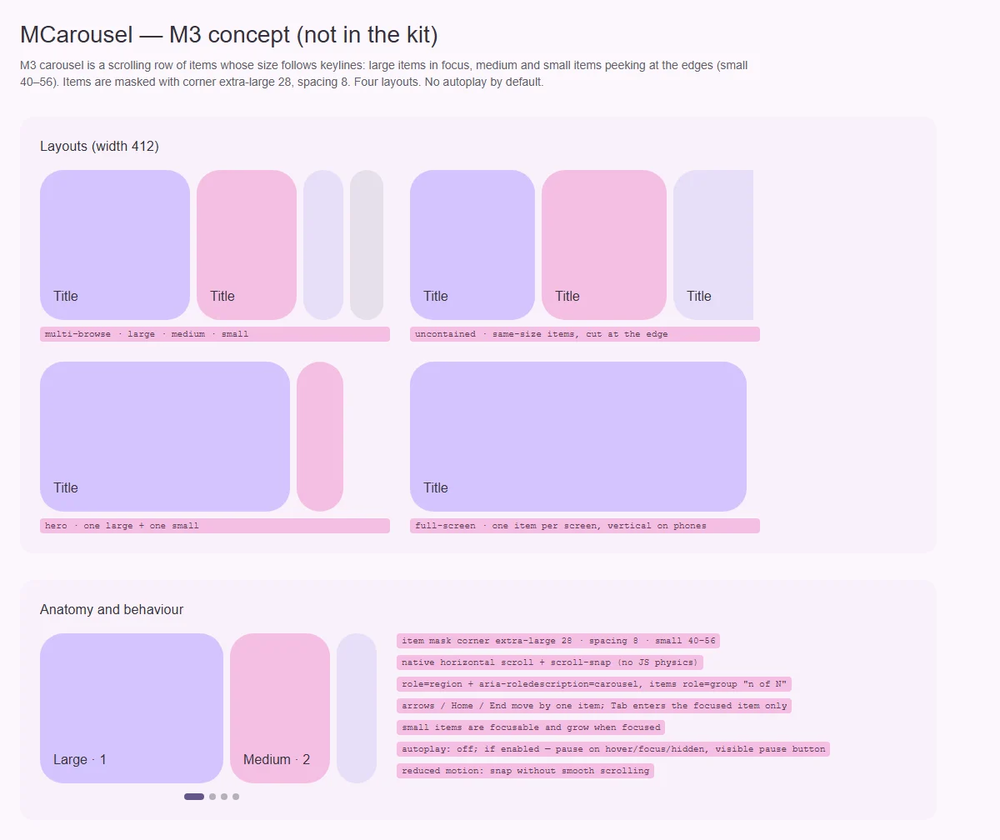

# MCarousel — прокручиваемый ряд элементов с ключевыми линиями (низкий приоритет)

<identity>M3: Carousel (multi-browse, uncontained, hero, full-screen) · Исходник: Compose `carousel/` (`Carousel.kt`, `Keylines.kt`, `Strategy.kt`, `MultiAspectCarousel.kt`); отдельных `*Tokens.kt` нет · Код: нет (предлагается `src/runtime/components/ui/carousel/` + приватный элемент, см. [item.md](item.md)) · Аудит: нет · Тип: public (gap)</identity>

<implementation-status state="pending" updated="2026-10-07">Компонента нет. План остаётся в low-priority: продвигается, когда у продукта появится конкретная поверхность с каруселью.</implementation-status>

## Вердикт

`нет в ките`. Прежний план был по образцу Vuetify: одно окно за раз, стрелки, автопрокрутка.
**Карусель M3 устроена иначе.** Это горизонтально прокручиваемый ряд, где размер элемента
задают ключевые линии (keylines):
- крупные элементы в фокусе;
- средние и маленькие (40–56) выглядывают с краёв;
- элементы маскируются скруглением extra-large 28 и разделены зазором 8.

Раскладки: multi-browse, uncontained, hero, full-screen. Автопрокрутка в M3 не основа, а
исключение.

Отказы прежнего плана остаются:
- нет автопрокрутки по умолчанию;
- нет загрузки данных;
- нет модели «только индекс».

## Рендеры

| Сейчас | Концепт M3 |
|---|---|
| — (нет в ките) |  |

Кадры концепта:
1. Четыре раскладки на ширине 412.
2. Анатомия (large, medium, small), индикатор позиции и правила поведения.

## Анатомия

| # | Часть M3 | Предлагаемая реализация |
|---|---|---|
| 1 | Контейнер прокрутки | `div` с `overflow-x: auto`, `scroll-snap-type: x mandatory`, `overscroll-behavior-x: contain` |
| 2 | Элемент с маской (corner extra-large) | приватный `CarouselItem` ([item.md](item.md)) |
| 3 | Размеры по ключевым линиям: large, medium, small 40–56 | ширины из стратегии раскладки (вопрос 1) |
| 4 | Индикатор позиции (необязателен) | точки с активной «таблеткой» |
| 5 | Стрелки (на указателе, не на таче) | `MButtonIcon` |

## Оси дизайна

| Ось | Значения | Комментарий |
|---|---|---|
| `layout` | `multi-browse \| uncontained \| hero \| full-screen` | раскладка M3 |
| `itemWidth` | число (large) | максимум для крупного элемента; остальное выводится стратегией |
| `autoplay` | `false \| { interval }` | по умолчанию выключено |
| `density` | — | не вводить |

## Оси состояний

| Ось | Нужно |
|---|---|
| Фокус | маленький элемент в фокусе прокручивается в крупную позицию |
| Прокрутка | snap к ключевой линии; под reduced motion без плавной прокрутки |
| Автопрокрутка | пауза на hover, на фокусе внутри, при скрытой вкладке; видимая кнопка паузы (WCAG 2.2.2) |

## Токены (новая карта)

| Часть | M3 | Токен |
|---|---|---|
| Скругление элемента | extra-large 28 | `item.shape` |
| Зазор | 8 | `item.gap: spacing(8)` |
| Маленький элемент | 40–56 | `item.small.min/max` |
| Индикатор | — | `indicator.*` |

## Поведение и доступность

- Корень — `role="region"`, `aria-roledescription="carousel"` и имя.
- Элементы — `role="group"`, `aria-roledescription="slide"`, «n из N».
- Стрелки, Home и End сдвигают по одному элементу. Tab входит только в текущий элемент.
- Прокрутка нативная, со `scroll-snap`, без JS-физики: это совпадает с решением владельца не
  наращивать бандл механизмами анимации.
- RTL — логическое направление.

## API

`items` (объекты с `id`), `v-model` — `id` текущего элемента, слот `#item`, `layout`,
`itemWidth`, `autoplay`, `ariaLabel` (обязателен).

## План работ (после продвижения)

1. **M — контейнер прокрутки, snap и раскладки со статичными ширинами по стратегии.**
2. **S — приватный элемент с маской** ([item.md](item.md)).
3. **M — клавиатура и роли.**
4. **S — стрелки на указателе, индикатор.**
5. **M — автопрокрутка с паузой** (opt-in).
6. **S — изменение ширин при прокрутке** — по вопросу 1.

## Тесты

Snap-позиции, клавиатура, роли и «n из N», пауза автопрокрутки, RTL, отсутствие
горизонтального переполнения страницы.

## Готово, когда

Четыре раскладки M3, доступная клавиатура, без автопрокрутки по умолчанию.

## Предложения по UX

Расширения сверх паритета с M3. Это предложения владельцу, а не шаги плана. Без Expressive-анимаций и без новых зависимостей.

| Предложение | Что получает пользователь | Заказчик | Цена | Рекомендация |
|---|---|---|---|---|
| Ленивая загрузка медиа элементов вне видимости (через `MLazy` / `loading="lazy"`) | Быстрее первая отрисовка ленты | любые медиа-ленты | S | да |
| Кнопка «Показать все» в конце ряда, ведущая в сетку | Пользователь не листает 30 элементов по одному | каталоги | S · слот `#end` | да |

## Открытые вопросы

**1. Меняются ли размеры элементов во время прокрутки (как в Compose)?**
1. Нет: ширины статичны по стратегии, работает только snap. Ноль JS, но без характерного
   «перетекания» M3.
2. CSS scroll-driven animations (`view-timeline`) как прогрессивное улучшение. Без JS там, где
   поддерживается; в остальных браузерах — вариант 1.
3. JS по `scroll` с rAF. Везде одинаково, но это механизм, который владелец просил не вводить.

Рекомендация: 1 сейчас, 2 позже.
