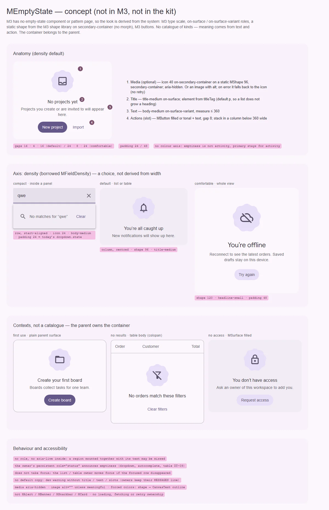

# MEmptyState — блок на месте отсутствующего основного содержимого (низкий приоритет)

<identity>M3: компонента нет; в M3 нет и отдельного паттерна пустых состояний. Вид выводится из системы: типографика (`title-medium`, `headline-small`, `body-medium`), роли `on-surface` / `on-surface-variant` / `secondary-container`, библиотека фигур (`MShape`, статично), кнопки M3 · Токены Compose: нет · Код: нет (предлагается `src/runtime/components/ui/empty-state/` поверх общего фрагмента `src/runtime/components/fragments/empty-state/`, см. вопрос 1) · Аудит: нет · Тип: public (gap)</identity>

<implementation-status state="pending" updated="2026-10-07">Компонента нет. Отложен, потому что пустое состояние собирается из `MSurface`, `MIcon`, типографики и `MButton`, а инфраструктуры, которой не хватает, у него нет. Продвигается, когда повторяющиеся экраны продукта показывают, что раскладка, медиа, адаптивные действия и доступность пустых состояний дублируются. Ближе всего к этому шаг 1 плана [list](../components-should-update/containment/list.md) и шаг 2 плана [table](../components-should-update/data/table.md): оба вводят `#empty` и предлагают общий фрагмент.</implementation-status>

## Вердикт

`нет в ките`. В M3 компонента нет, это авторский блок на системе M3. Он ставится туда, где должно
быть основное содержимое, а его нет:
- данных ещё нет (первый запуск);
- поиск или фильтр ничего не нашёл;
- нет доступа или сети, и это восстановимо действием.

Внутри: медиа, заголовок, текст и действия. Прежнее решение остаётся: фиксированного каталога
`empty | error | offline` нет, смысл задаёт потребитель текстом и действием.

Главное, что нужно решить до кода, — не дублировать то, что уже есть. Слоты `#empty` живут у
пяти компонентов, и каждый рисует пустоту по-своему (вопрос 1).

Отказы прежнего плана остаются:
- это не `MAlert`, не `MBanner`, не `MSnackbar` и не `MCard`;
- компонент не владеет загрузкой, элементами, ошибками, запросами и повтором;
- загрузку показывают [MLoading](../components-should-update/feedback/loading.md) и
  [MProgress](../components-should-update/feedback/progress.md);
- действия — это `MButton` в слоте.

## Рендеры

| Сейчас | Концепт |
|---|---|
| — (нет в ките) |  |

Кадры концепта:
1. Анатомия: медиа на статичной фигуре, заголовок, текст, действия. Выноски значений.
2. Ось `density`: `compact` (строка в панели, совпадает с нынешним `dropdown.state`), `default`
   (блок в списке или таблице), `comfortable` (весь экран).
3. Контексты без каталога: первый запуск с действием «создать», «ничего не найдено» со сбросом,
   восстановимая ошибка доступа. Контейнер даёт родитель: голая поверхность, `MSurface filled`,
   тело таблицы.
4. Доступность: тег заголовка задаёт потребитель, медиа декоративно, живого региона внутри нет,
   фокус не прыгает.

## Анатомия

| # | Часть | Предлагаемая реализация | Есть сейчас |
|---|---|---|---|
| 1 | Медиа (необязательно) | слот `#media`; по умолчанию `MIcon` на статичной `MShape` (вопрос 4); `image` → ``, при ошибке загрузки — иконка | `MShape`, `MIcon` есть |
| 2 | Заголовок | `title` / слот `#title`, тег — `titleTag` | — |
| 3 | Текст | `text` / слот по умолчанию | — |
| 4 | Действия (необязательно) | слот `#actions`: `MButton` filled или tonal + text | `MButton` есть |
| — | Контейнер | не часть компонента: голая поверхность родителя, `MSurface`, `MCard`, ячейка таблицы (вопрос 2) | `MSurface` есть |

## Оси дизайна

| Ось | Значения | Комментарий | Ломает API |
|---|---|---|---|
| `density` | `compact \| default \| comfortable`, дефолт `default` | одолжена у `MFieldDensity` (`axes.md`: ссылка на тип, не копия). Плотность — выбор, а не производная от ширины (`decisions.md`) | нет |
| Медиа | иконка · картинка · нет | через пропы `icon`, `image` и слот `#media`; не ось | нет |
| `variant` | — | своей обработки поверхности нет, контейнер — у родителя (вопрос 2) | нет |
| `color` | — | не вводится: пустота — не роль. `primary` означает активность (`color-and-state.md`) | нет |

Ступени `density`:

| Ступень | Где | Раскладка | Медиа | Заголовок | Отступы |
|---|---|---|---|---|---|
| `compact` | панель дропдауна, автокомплита, поиска; короткий список | строка, по началу | иконка 24 без фигуры | нет, только текст `body-medium` | 24 (как `dropdown.state.padding`) |
| `default` | список, таблица, карточка | столбец по центру | фигура 96, иконка 40 | `title-medium` | 24 |
| `comfortable` | весь экран или крупная панель | столбец по центру | фигура 120, иконка 48 | `headline-small` | 48 |

## Оси состояний

| Ось | Нужно | Комментарий |
|---|---|---|
| Базовое | показан / не показан | компонент пассивен: hover, pressed, focus — у кнопок в `#actions` |
| Медиа | загружается · загружена · ошибка | ошибка картинки → иконка, без повтора (прежнее решение); `load` / `error` отдаются событиями |
| Объявление | появление пустоты слышно | не внутри компонента: регион монтируется вместе с содержимым и ненадёжен (вопрос 3) |
| Направление | LTR, RTL | `compact` выравнивается по логическому началу |
| Forced colors | фигура и текст видны | фигура декоративна, в forced colors — `CanvasText`, без фона |
| Узкий контейнер | действия не вылезают | при ширине меньше 360 действия встают в столбец (container query по `inline-size`) |

## Токены (новая карта)

| Часть | Значение по системе M3 | Токен `g()` |
|---|---|---|
| Фигура медиа | `secondary-container`; `default` 96, `comfortable` 120; форма `9SidedCookie` (вопрос 4) | `media.shape.color`, `density.<ступень>.media.size` |
| Иконка медиа | `on-secondary-container`; 40 / 48; в `compact` — 24, `on-surface-variant`, без фигуры | `media.icon.color`, `density.<ступень>.icon.size` |
| Заголовок | `on-surface`; `title-medium` (`default`), `headline-small` (`comfortable`) | `title.color`, `density.<ступень>.title.typescale` |
| Текст | `on-surface-variant`, `body-medium`; ширина строки до 360 (`default`) и 400 (`comfortable`) | `text.color`, `text.typescale`, `density.<ступень>.text.max-inline` |
| Зазоры | медиа → заголовок 16 / 24; заголовок → текст 4 / 8; текст → действия 16 / 24; между действиями 8 | `density.<ступень>.gap.*` через `spacing()` |
| Отступы | 24 / 24 / 48 | `density.<ступень>.padding` |
| Compact | совпадает с `dropdown.state` (`padding: spacing(24)`, `on-surface-variant`) | `density.compact.*` |

Чисел вне шкалы `spacing()` и типографики M3 нет. Контейнер, рамка и тень не токенизируются здесь:
они принадлежат `MSurface` или `MCard`.

## Поведение и доступность

- **Семантика.** Корень — `div` без роли. Заголовок рендерится тегом из `titleTag`, дефолт `p`:
  пустое состояние внутри списка не должно добавлять заголовок в структуру документа. На весь
  экран потребитель ставит `h2` или `h1`.
- **Медиа.** Иконка и фигура — `aria-hidden="true"`. У картинки `alt=""`, если она декоративна;
  если несёт смысл — `imageAlt`.
- **Объявление.** Компонента, который монтируется вместе с содержимым, скринридер может не
  услышать, если регион появился одновременно с текстом. Это правило живых регионов кита. Пустоту
  объявляет постоянный `role="status"` владельца: он уже есть у дропдауна и автокомплита, у таблицы
  он запланирован (DT-09). Прежний проп `announce` — вопрос 3.
- **Фокус.** Компонент не забирает фокус при появлении. Если пустота заменила строку, где стоял
  фокус, фокусом управляет владелец (список, таблица), а не пустое состояние.
- **Тексты.** Дефолтных строк нет: кит не поставляет непереводимого текста. Без `title`, `text` и
  слотов в деве выводится предупреждение. Исключение — запасной `compact` у владельцев, которые
  сегодня держат свою строку в `MESSAGES` (`dropdownEmpty`, `dropdownNoResults`); она остаётся у
  них.
- **SSR.** Разметка статична, медиа и текст есть в серверном HTML. Без `onMounted`.

## API

```ts
import type { MFieldDensity } from '#kit/components/ui/text-field/props'

export type MEmptyStateDensity = MFieldDensity

export const mEmptyStateProps = {
  title: String,
  text: String,
  icon: String,                 // имя Iconify; без него и без image медиа нет
  image: String,
  imageAlt: { type: String, default: '' },
  density: { type: String as PropType<MEmptyStateDensity>, default: 'default' },
  titleTag: { type: String as PropType<'h1' | 'h2' | 'h3' | 'h4' | 'h5' | 'h6' | 'p'>, default: 'p' },
}
```

Слоты: `media`, `title`, `default` (текст), `actions`. События: `load`, `error` у картинки.

Изменения против прежнего плана:
- канонический `size` → `density` (решение S5);
- `variant: plain | tonal` и `announce: off | polite` — вопросы 2 и 3.

## План работ (после продвижения)

1. **S — общий фрагмент** `components/fragments/empty-state/`: разметка, карта `$tokens`, три
   ступени `density`. Если раньше его сделает [list](../components-should-update/containment/list.md)
   (предложение 4) или [table](../components-should-update/data/table.md) (шаг 2), этот шаг уже
   выполнен.
2. **S — публичная обёртка `MEmptyState`**: пропы, слоты, dev-предупреждение без текста.
3. **S — медиа**: иконка на фигуре, картинка с запасной иконкой, события `load` / `error`.
4. **S — узкий контейнер**: действия в столбец по container query `inline-size`.
5. **S — переход владельцев** по вопросу 1: дефолтное содержимое `#empty` у `MList`, `MTable`,
   `MDropdown`, `MAutocomplete`, `MChipGroup` рисуется фрагментом. Сами слоты не меняются.
6. **S — тесты и документация**: рецепты «первый запуск», «ничего не найдено», «нет доступа».

## Тесты

- Unit: слоты и пропы; `titleTag`; картинка с ошибкой → иконка; нет `role` и `aria-live`; dev-предупреждение без текста.
- Фикстуры `matrix` / `stress`: `density` × медиа × действия; длинный заголовок и текст без пробелов.
- e2e: axe; RTL; ширина 320 без горизонтального переполнения; forced colors; пустой список с
  постоянным статусом владельца объявляется один раз.

## Готово, когда

- [ ] Три ступени `density`, `compact` визуально совпадает с нынешним `dropdown.state`.
- [ ] Пустые состояния в списке, таблице и дропдауне нарисованы одним фрагментом.
- [ ] Компонент не объявляет себя сам и не забирает фокус.
- [ ] Нет дефолтного английского текста.
- [ ] `lint`, `lint:style`, `lint:scss`, `typecheck`, e2e — зелёные.

## Предложения по UX

Это предложения владельцу, а не шаги плана. Без новых зависимостей.

| Предложение | Что получает пользователь | Заказчик | Цена | Рекомендация |
|---|---|---|---|---|
| Рецепт «ничего не найдено»: в `#actions` кнопка сброса запроса или фильтров | Выход из тупика одним нажатием, а не стиранием запроса руками | [autocomplete](../components-should-update/inputs/autocomplete.md) (вопрос 3), [search](../components-should-update/inputs/search.md), таблицы с фильтрами | S · только документация | да |
| Три рецепта вместо каталога: первый запуск (создать), ничего не найдено (сбросить), нет доступа (запросить) | Пустота всегда объясняет причину и предлагает действие | все продукты | S · документация, без API | да |
| Действия в столбец в узком контейнере (шаг 4) | Кнопки не обрезаются в колонке 280 | сайдбары, панели | S · container query `inline-size`, разрешённый в `decisions.md` | да |
| Картинка через `MImage` с ленивой загрузкой, когда появится ([image](../pending-components/image.md)) | Иллюстрация не тормозит первую отрисовку | экраны первого запуска | M · зависит от `MImage` | после `MImage` |

## Открытые вопросы

**1. Одна реализация для `#empty` у владельцев и для `MEmptyState`?**
1. Да. Сначала общий фрагмент (его уже предлагает план list), владельцы рисуют им дефолт `#empty`.
   `MEmptyState` — публичная обёртка над тем же фрагментом, когда сработает условие продвижения.
   Один вид пустоты во всём ките, ни одной копии.
2. Только фрагмент, публичного компонента нет. Меньше API, но потребитель собирает пустоту на
   своих экранах вручную.
3. Только публичный компонент, владельцы его не используют. Пустота в дропдауне, списке и
   таблице так и останется разной.

Рекомендация: 1.

**2. Нужна ли своя ось `variant` (прежний план: `plain | tonal`)?**
1. Нет. Контейнер даёт родитель (`MSurface`, `MCard`, ячейка таблицы), пустое состояние — только
   содержимое. Без нового слова, без конфликта с `MVariant`.
2. `variant: 'plain' | 'filled'` словами `MSurface`. Удобно для экрана целиком, но повторяет
   `MSurface`.
3. `plain | tonal`, как в прежнем плане. Но `tonal` в ките означает `<role>-container` у кнопок, а
   у пассивного блока это была бы другая смысловая единица под тем же словом (`axes.md`).

Рекомендация: 1.

**3. Проп `announce` (прежний план: `off | polite`).**
1. Убрать. Пустоту объявляет постоянный `role="status"` владельца, который смонтирован до
   появления пустоты.
2. Оставить `role="status"` на самом компоненте. Он монтируется вместе с текстом, и скринридеры
   могут его пропустить.
3. Оставить `announce` только как документированный `aria-live` для статичных экранов. Сложно
   объяснить, когда он работает, а когда нет.

Рекомендация: 1.

**4. Медиа по умолчанию.**
1. Иконка на статичной фигуре `MShape` в `secondary-container` для `default` и `comfortable`, в
   `compact` — голая иконка. Фигура M3 Expressive без морфа (S3 допускает статичную форму).
2. Голая иконка 48 в `on-surface-variant` на всех ступенях. Тише и ближе к нынешнему дропдауну.
3. Медиа по умолчанию нет, только `icon`, `image` или слот.

Рекомендация: 1.
