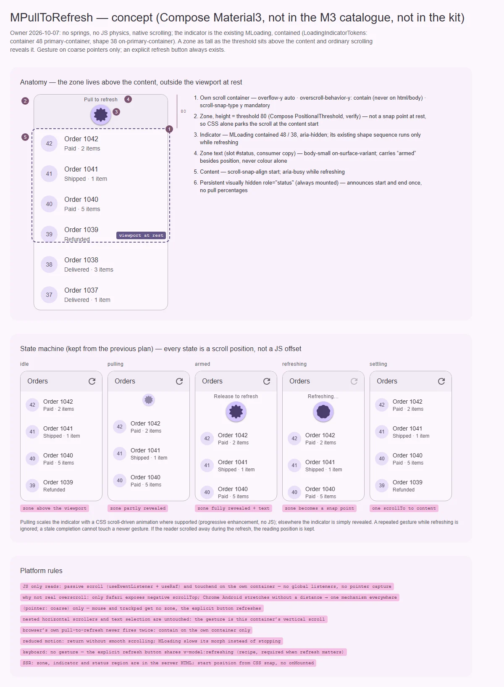

# MPullToRefresh — обновление жестом «потянуть вниз» в начале прокрутки (низкий приоритет)

<identity>M3: в каталоге m3.material.io компонента нет; есть в Compose Material3 — `androidx.compose.material3.pulltorefresh.PullToRefreshBox`, индикатор — contained loading indicator (`LoadingIndicator.kt`: «can also be used as an indicator for a PullToRefreshBox») · Токены Compose: `LoadingIndicatorTokens.kt` (контейнер 48, фигура 38, `primary-container` / `on-primary-container`); исходника пакета `pulltorefresh/` в распаковке нет · Код: нет (предлагается control-композабл `src/runtime/composables/pull-to-refresh/usePullToRefresh.ts` + тонкий `src/runtime/components/ui/pull-to-refresh/`, вопрос 1) · Аудит: нет · Тип: public (gap)</identity>

<implementation-status state="pending" updated="2026-10-07">Компонента нет. Это удобство тач-интерфейса, а не основа работы с данными: продукты могут обойтись явной кнопкой обновления, у которой нет неоднозначности жеста. Продвигается, когда у продукта появится тач-ориентированный сценарий, которому нужен жест, и для арбитража прокрутки будут отдельные тесты на устройствах. До финального API решить: композабл или компонент (вопрос 1), колбэк или управляемое состояние (вопрос 2).</implementation-status>

## Вердикт

`нет в ките`. В каталоге M3 компонента нет, в Compose Material3 есть `PullToRefreshBox`. Его
индикатор — тот же contained loading indicator, что в плане
[MLoading](../components-should-update/feedback/loading.md).

Решение владельца (2026-10-07):
- без пружин и механизмов, которые растят бандл;
- жест — нативная прокрутка контейнера, без JS-физики и `transform` по пальцу;
- индикатор — существующий `MLoading` в contained-варианте.

Поэтому кит не копирует Compose, где индикатор тянется за пальцем с сопротивлением. Над содержимым
лежит зона высотой с порог, её открывает обычная прокрутка. Прокрутка завершена на зоне —
обновление.

Прежнее предпочтение «жест через `useDrag`» снято этим решением. Все отказы прежнего плана
остаются:
- нет загрузки данных;
- нет политики инвалидации кэша;
- нет глобального CSS для overscroll;
- жест не заменяет доступную явную кнопку обновления;
- нет реализации без подтверждённой тач-поверхности продукта.

## Рендеры

| Сейчас | Концепт |
|---|---|
| — (нет в ките) |  |

Кадры концепта:
1. Анатомия: свой контейнер прокрутки, зона над содержимым (порог 80), индикатор `MLoading`
   contained 48 / 38, содержимое, постоянный статус, явная кнопка у потребителя.
2. Машина состояний прежнего плана на телефоне 360: покой → тянет → взведено → обновление →
   возврат. Каждое состояние показано положением прокрутки, а не сдвигом по JS.
3. Правила платформы: указатель, вложенные и горизонтальные прокрутки, нативный жест браузера,
   reduced motion, клавиатура.

## Анатомия

| # | Часть | Предлагаемая реализация |
|---|---|---|
| 1 | Контейнер прокрутки (свой) | корень: `overflow-y: auto`, `overscroll-behavior-y: contain`, `scroll-snap-type: y mandatory` |
| 2 | Зона обновления | блок высотой с порог над содержимым; в покое не точка привязки, поэтому браузер ставит прокрутку на начало содержимого без JS |
| 3 | Индикатор | `MLoading` contained (`LoadingIndicatorTokens`: контейнер 48 `primary-container`, фигура 38 `on-primary-container`), у нижнего края зоны с отступом 8: прокрутка открывает его первым; `aria-hidden` |
| 4 | Подпись в зоне (необязательно) | над индикатором; слот `#status` со `state`: «Потяните», «Отпустите», «Обновлено в 12:30»; текст потребителя |
| 5 | Содержимое | слот по умолчанию, `scroll-snap-align: start`; `aria-busy` во время обновления |
| 6 | Постоянный статус | визуально скрытый `role="status"`, смонтирован всегда; текст потребителя |
| — | Явная кнопка обновления | у потребителя (app bar, toolbar), делит с жестом одно состояние `refreshing` |

## Оси дизайна

| Ось | Значения | Комментарий |
|---|---|---|
| `density` | — | не вводится. Индикатор — `MLoading` на своей ступени `default` 48 (вопрос 2 плана loading) |
| `color` | — | не вводится. Contained-индикатор на `primary`-ролях: обновление — это активность |
| Порог | 80, токен | Compose `PullToRefreshDefaults.PositionalThreshold` (по памяти, сверить по исходнику при продвижении). Пропа нет, пока нет заказчика (В4) |
| `disabled` | `boolean` | честный флаг: второго значения у «жест выключен» нет |

## Оси состояний

Машина состояний из прежнего плана остаётся:

```text
idle
└── прокрутка вверх за начало содержимого → pulling
    ├── отпустил до порога → settling → idle
    └── зона открыта целиком → armed
        ├── вернул прокрутку вниз → pulling
        └── отпустил → refreshing
            └── потребитель завершил → settling → idle
```

| Ось | Нужно | Как |
|---|---|---|
| Жест | idle · pulling · armed · refreshing · settling | положение прокрутки относительно зоны; во время `refreshing` повторный жест заблокирован |
| Взведено | не только цветом | зона открыта целиком + подпись в `#status` («Отпустите») |
| Устаревшее завершение | не трогает новый жест | счётчик версии: завершение старого обновления не меняет новое (прежний план) |
| Выключено | жест не работает | зона не рендерится, содержимое прокручивается обычно |
| Reduced motion | без плавности | возврат `behavior: 'auto'`; морф `MLoading` под reduced motion замедляется (правило плана loading) |
| Forced colors | индикатор виден | наследует правило `MLoading` (`CanvasText`) |

## Токены (новая карта)

| Часть | Значение | Токен `g()` |
|---|---|---|
| Высота зоны (порог) | 80 | `zone.size` |
| Индикатор | `MLoading` contained: 48 / 38, `primary-container` / `on-primary-container` | своих токенов нет: карта `loading` (ветка `contained`, шаг 3 плана loading) |
| Тень индикатора | в `LoadingIndicatorTokens` нет; индикатор стоит над содержимым | `indicator.elevation: elevation(1)` — открытый пункт сверки с исходником Compose |
| Подпись зоны | `body-small`, `on-surface-variant`, отступ от индикатора 8 | `status.typescale`, `status.color`, `status.gap` |
| Смена подписи и масштаба индикатора | `--sys-motion-duration-short-4`, `--sys-motion-easing-standard` | `motion.*`. Возврат прокрутки — `scrollTo({ behavior: 'smooth' })`, его длительность выбирает браузер, токен к нему не применяется |

## Поведение и доступность

- **Механизм (решение владельца).** Нативная прокрутка:
  - зона над содержимым; `scroll-snap-type: y mandatory`, точка привязки — только у содержимого;
  - в покое браузер держит прокрутку на начале содержимого, зона скрыта за верхним краем;
  - палец тянет вниз в начале списка — браузер прокручивает в зону сам, со своей инерцией;
  - JS только читает положение: `scroll` (пассивный, через `useEventListener`, троттлинг `useRaf`)
    и `touchend` на своём контейнере. Глобальных слушателей нет.
- **Почему не настоящий overscroll.** Отрицательный `scrollTop` при «резинке» есть только в
  Safari. Chrome на Android рисует растяжение, но расстояния не сообщает. Мерить его кросс-
  платформенно нельзя, а зона над содержимым работает везде одинаково — одна механика на браузер
  (`craft.md` §7).
- **Обновление.** Отпустил во взведённом состоянии → `refreshing`:
  - зона становится точкой привязки, и прокрутка останавливается на индикаторе;
  - `MLoading` крутит свою последовательность фигур (JS-пружины `MShape` уже в бандле);
  - `aria-busy="true"` на содержимом.
- **Возврат.** Потребитель снимает `refreshing` → зона перестаёт быть точкой привязки → одна
  программная прокрутка к началу содержимого. Если пользователь за время обновления ушёл вниз,
  позицию чтения не трогаем (прежний план).
- **Арбитраж.**
  - Горизонтальные карусели и вложенные прокрутки внутри не мешают: жест — это вертикальная
    прокрутка именно этого контейнера.
  - Выделение текста не ломается: захвата указателя нет.
  - Нативное обновление браузера не срабатывает дважды: `overscroll-behavior-y: contain` стоит
    только на своём контейнере и никогда не на `html` или `body`.
- **Указатель.** Жест только при `(pointer: coarse)`. На мыши и тачпаде зона не рендерится, работает
  явная кнопка (вопрос 3).
- **Объявления.** Проценты натяжения не объявляются. Постоянный `role="status"` один раз сообщает
  начало и конец обновления текстом потребителя; английских дефолтов нет. Без текста — dev-
  предупреждение.
- **Клавиатура.** Жеста с клавиатуры нет. Явная кнопка потребителя с тем же `refreshing` — обязательная
  часть рецепта, когда обновление существенно.
- **SSR.** Зона, индикатор и регион есть в серверном HTML. Начальное положение даёт CSS-привязка,
  без `onMounted`. Проверяется в e2e на мобильных движках. Если привязка при первой раскладке не
  сработает, запасной путь — установка `scrollTop` в `onMounted` (браузерный API, разрешено).

## API

```ts
// Поведение: бэги атрибутов, без классов и data-* (behavior.md)
export type PullToRefreshState = 'idle' | 'pulling' | 'armed' | 'refreshing' | 'settling'

export interface UsePullToRefreshOptions {
  container: MaybeRefOrGetter<HTMLElement | null>
  refreshing: Ref<boolean>
  disabled?: MaybeRefOrGetter<boolean>
  onRefresh: () => void
}

export interface UsePullToRefreshReturn {
  state: Readonly<Ref<PullToRefreshState>>
  rootAttrs: Readonly<Ref<HTMLAttributes>>
  zoneAttrs: Readonly<Ref<HTMLAttributes>>
  contentAttrs: Readonly<Ref<HTMLAttributes>>
}
```

```vue
<MPullToRefresh
  v-model:refreshing="busy"
  :status-label="busy ? 'Обновление' : 'Список обновлён'"
  @refresh="reload"
>
  <template #status="{ state }">…</template>
  …
</MPullToRefresh>
```

Изменения против прежнего плана: решены механизм (нативная прокрутка, не `useDrag`) и
индикатор (`MLoading`). Колбэк против управляемого состояния — вопрос 2.

## План работ (после продвижения)

1. **M — `usePullToRefresh`**: машина состояний над положением прокрутки, `touchend`, защита
   от устаревшего завершения, бэги атрибутов. Спека «без классов и `data-*`».
2. **S — компонент**: контейнер, зона, `MLoading` contained, слоты, постоянный статус. Зависит от
   шага 3 плана [loading](../components-should-update/feedback/loading.md) (contained).
3. **S — токены**: `zone.size`, `status.*`, `motion.*`, тень индикатора после сверки.
4. **S — платформа**: `(pointer: coarse)`, `overscroll-behavior-y: contain` только на своём
   контейнере, reduced motion.
5. **M — тесты на устройствах** (условие продвижения прежнего плана): Chrome Android, Safari iOS,
   вложенная горизонтальная прокрутка, PWA-режим.
6. **S — документация**: рецепт «жест + явная кнопка на одном `refreshing`».

## Тесты

- Unit (композабл): переходы машины по смоделированному положению прокрутки; повторный жест во
  время `refreshing` игнорируется; устаревшее завершение не меняет новый жест; бэги без `class` и
  `data-*`; `disabled`.
- e2e (мобильные профили Playwright): начальное положение — начало содержимого, зона не видна;
  жест до порога возвращается без события; за порогом — одно `refresh`; нет двойного обновления
  страницы; горизонтальная карусель внутри не взводит жест; reduced motion; axe; статус
  объявляется один раз.

## Готово, когда

- [ ] Жест — нативная прокрутка, без JS-сдвига содержимого и без новых зависимостей.
- [ ] Индикатор — `MLoading` contained, своих фигур и пружин нет.
- [ ] Одно событие `refresh` на жест, повтор во время обновления заблокирован.
- [ ] Нативное обновление браузера не срабатывает дважды, глобального CSS нет.
- [ ] Позиция чтения не прыгает после обновления.
- [ ] Рецепт с явной кнопкой в документации; `lint`, `lint:style`, `lint:scss`, e2e — зелёные.

## Предложения по UX

Это предложения владельцу, а не шаги плана. Без Expressive-анимаций и без новых зависимостей.

| Предложение | Что получает пользователь | Заказчик | Цена | Рекомендация |
|---|---|---|---|---|
| «Обновлено в 12:30» в зоне через слот `#status` | Видно, насколько свежие данные, ещё до жеста | ленты, списки заказов | S · слот, текст потребителя | да |
| Одно `refreshing` на жест и явную кнопку (рецепт; кнопка — `MButton loading`) | Один индикатор ожидания, с какой стороны ни начать | все потребители жеста | S · документация | да |
| Короткая вибрация при взведении (`navigator.vibrate(10)` там, где есть) | Палец «чувствует» порог без взгляда на индикатор | мобильные PWA | S · одна строка, Android only | нет: на iOS не работает, ощущение будет разным |

## Открытые вопросы

**1. Композабл, компонент или оба (условие прежнего плана)?**
1. Control-композабл `usePullToRefresh` + тонкий `MPullToRefresh` как его потребитель. Слоистость
   `behavior.md`: стёр тег, оставил `v-bind` — жест работает.
2. Только компонент. Меньше API, но потребитель со своей разметкой списка повторит механизм.
3. Только композабл. Индикатор, зону и статус каждый потребитель собирает сам.

Рекомендация: 1.

**2. Колбэк или управляемое состояние (открыто прежним планом)?**
1. `v-model:refreshing` + событие `refresh`. Обновление, начатое кнопкой, показывает тот же
   индикатор; завершение — `busy = false`.
2. Проп `onRefresh: () => Promise<void>`: компонент держит `refreshing`, пока промис не
   завершится. Защита от устаревшего завершения бесплатна, но обновление извне не показать.
3. Оба. Два пути к одному состоянию.

Рекомендация: 1.

**3. Жест на мыши и тачпаде.**
1. Только `(pointer: coarse)`; на точном указателе зона не рендерится, работает явная кнопка.
2. Везде. Колесо и тачпад тоже открывают зону, но на десктопе это неожиданно и ловится случайно.

Рекомендация: 1.

**4. Индикатор во время натяжения.**
1. Статичный `MLoading` открывается прокруткой. Масштаб и прозрачность — CSS scroll-driven
   animation как прогрессивное улучшение, без JS. Где не поддерживается — просто открывается.
2. Морф фигуры по проценту натяжения, как `ContainedLoadingIndicator(progress)` в Compose. Нужен JS
   на каждый кадр прокрутки — механизм, которого владелец просил не вводить.
3. Статичный индикатор без всякой реакции на натяжение.

Рекомендация: 1.
