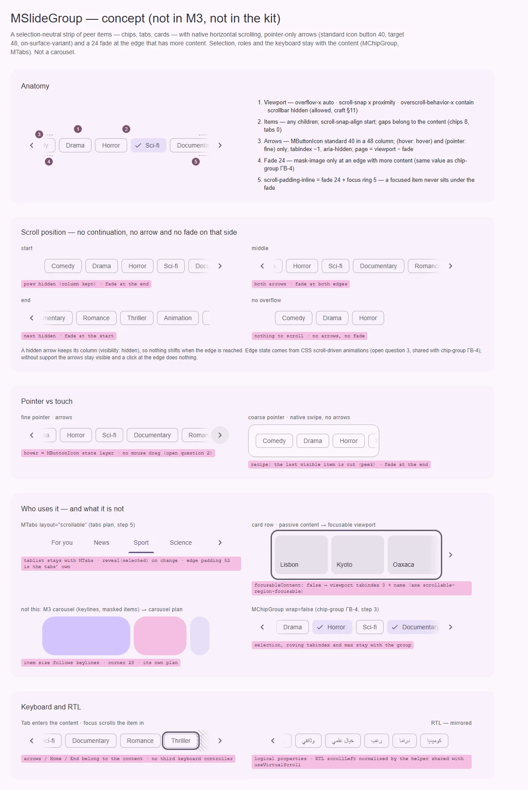

# MSlideGroup — горизонтальная полоса равноправных элементов с прокруткой и стрелками (низкий приоритет)

<identity>M3: компонента нет. Опоры в системе: scrollable tabs (`TabRow.kt`: `ScrollableTabRowEdgeStartPadding = 52`, `ScrollableTabRowMinTabWidth = 90`, активная вкладка прокручивается в видимую зону), chip set (material-web), standard icon button (`IconButtonTokens`: `on-surface-variant`; `SmallIconButtonTokens`: 40, иконка 24). Carousel — отдельный компонент M3 с другой моделью ([carousel](../carousel/index.md)) · Токены Compose: своих нет · Код: нет (предлагается control-композабл `src/runtime/composables/slide-group/useScrollOverflow.ts` + тонкая оболочка `src/runtime/components/ui/slide-group/` + приватный элемент, см. [item.md](item.md), — по вопросу 1) · Аудит: нет · Тип: public primitive (gap)</identity>

<implementation-status state="pending" updated="2026-10-07">Компонента нет. Сегодня чипы и вкладки обходятся переносом или нативной прокруткой. Аккуратная группа требует согласованного состояния прокрутки, RTL, стрелок, фокуса и показа активного элемента, но ничего более важного не блокирует. Продвигается, когда несколько семейств потребуют одних и тех же доступных стрелок и показа активного элемента, а нативной прокрутки и переноса станет мало. Кандидаты уже есть: шаг 5 и предложение «шевроны» в плане [tabs](../../components-should-update/navigation/tabs.md), ГВ-4 в плане [chip-group](../../components-should-update/form/chip-group.md), где стрелки прямо отложены «до `MSlideGroup`».</implementation-status>

## Вердикт

`нет в ките`. В M3 компонента нет, это авторский примитив на системе M3.

Уточнение прежнего плана остаётся. Это не карусель контента, а полоса равноправных элементов —
обычно чипов или вкладок — с прокруткой, стрелками на краях, затуханием у края с продолжением и
показом активного элемента. Карусель M3 со своими ключевыми линиями, маской и слайдами — отдельный
компонент ([carousel](../carousel/index.md)), здесь её модель не повторяется.

Главная развилка — нужен ли отдельный компонент (вопрос 1). Выбор уже есть у
[MChipGroup](../../components-should-update/form/chip-group.md) и
[MTabs](../../components-should-update/navigation/tabs.md). Собственный выбор у полосы стал бы
третьим контрактом выбора и третьим клавиатурным контроллером, а `behavior.md` запрещает молча
заводить третий. Поэтому план предлагает примитив **без выбора**: он умеет прокручивать, показывать
края и активный элемент, а выбор, роли и клавиатура остаются у содержимого.

## Рендеры

| Сейчас | Концепт |
|---|---|
| — (нет в ките) |  |

Кадры концепта:
1. Анатомия: вьюпорт, элементы, стрелки, затухание у края, запас прокрутки под стрелку и кольцо.
2. Положения прокрутки: начало, середина, конец, без переполнения. Где нет продолжения, нет ни
   стрелки, ни затухания.
3. Указатель и тач: стрелки только на точном указателе, на таче — нативный свайп.
4. Кто пользуется и чем это не является: chip-group с `wrap=false`, tabs `layout="scrollable"`,
   ряд карточек. Рядом — карусель M3 для сравнения.
5. Клавиатура и RTL: Tab входит в содержимое, фокус сам прокручивает элемент в видимую зону,
   стрелки скрыты от AT; в RTL всё зеркально.

## Анатомия

| # | Часть | Предлагаемая реализация | Опора |
|---|---|---|---|
| 1 | Вьюпорт | `overflow-x: auto`, `scroll-snap-type: x proximity`, `overscroll-behavior-x: contain`, `scrollbar-width: none` (скрыть разрешено, `craft.md` §11) | tabs scrollable (шаг 5 плана tabs) |
| 2 | Элементы | любые дети: `MChip`, `MTab`, карточки; `scroll-snap-align: start` на прямых детях | — |
| 3 | Стрелки «назад» / «вперёд» | `MButtonIcon` standard, `density` default (40, цель 48), `chevron_left` / `chevron_right`, в RTL зеркально; только `(hover: hover) and (pointer: fine)` | `IconButtonTokens`, `SmallIconButtonTokens` |
| 4 | Затухание у края | `mask-image` 24 у края, за которым есть продолжение | ГВ-4 плана chip-group |
| 5 | Запас прокрутки | `scroll-padding-inline` = затухание 24 + кольцо фокуса 5 (3 + смещение 2) | шаг 3 плана chip-group |

## Оси дизайна

| Ось | Значения | Комментарий | Ломает API |
|---|---|---|---|
| Стрелки | `arrows: 'pointer' \| 'never'`, дефолт `pointer` | `always` (стрелки и на таче) не вводится: заказчика нет (В4) | нет |
| Размещение стрелок | снаружи полосы · поверх затухания | вопрос 4 | нет |
| Направление | только горизонталь | прежний `direction` без заказчика вертикали (В4) | нет |
| Выбор | нет | у содержимого (вопрос 1); прежний кандидат `single / multiple / mandatory` снимается | нет |
| `density` | — | своей нет; стрелки берут `density` `MButtonIcon` по умолчанию | нет |

## Оси состояний

| Ось | Нужно | Как |
|---|---|---|
| Положение | начало · середина · конец · без переполнения | нет продолжения — нет стрелки и затухания с этой стороны; механизм — вопрос 3 |
| Стрелка | rest · hover · pressed · focus · скрыта | состояния — у `MButtonIcon`; скрытая стрелка сохраняет колонку (`visibility: hidden`), раскладка не едет |
| Фокус внутри | сфокусированный элемент виден | браузер прокручивает его сам; `scroll-padding-inline` не даёт ему встать под затухание |
| Активный элемент | виден после выбора и при загрузке | `reveal(el)` у владельца (tabs, chip-group) |
| RTL | зеркально | логические свойства; нормализация `scrollLeft` в RTL — общий помощник с `useVirtualScroll` (горизонтальный режим) |
| Reduced motion | без плавности | `scrollBy` / `scrollTo` с `behavior: 'auto'` |
| Forced colors | стрелки видны | наследуют `MButtonIcon`; маска затухания не влияет |

## Токены (новая карта)

| Часть | Значение | Токен `g()` |
|---|---|---|
| Стрелка | `MButtonIcon` standard: 40, иконка 24, `on-surface-variant`, слой состояний свой | своих токенов нет: карта `icon-button` |
| Колонка стрелки | 48 (цель нажатия, S8) | `arrow.column` |
| Затухание | 24 | `fade.size` (одно значение с chip-group) |
| Запас прокрутки | затухание + кольцо 5 из `$theme-focus-link` | `scroll-padding` (выводится, не литерал) |
| Шаг стрелки | ширина вьюпорта минус затухание: последний видимый элемент остаётся в кадре | поведение, не токен |
| Начальный отступ | 0; у tabs `layout="scrollable"` — свои 52 из Compose | у tabs, не здесь |

Зазоры между элементами принадлежат содержимому: у чипов 8, у вкладок 0.

## Поведение и доступность

- **Семантика.** Своей роли у вьюпорта нет: её даёт содержимое (`tablist`, `role="group"` у
  chip-group). Вьюпорт — `div` без роли. Такой промежуточный элемент между `tablist` и `tab` ARIA
  допускает, но владелец может поставить `tablist` прямо на вьюпорт через его атрибуты.
- **Клавиатура.** Своей карты нет: стрелки, Home и End — у содержимого (roving у chip-group, APG
  tabs у `MTabs`). Сфокусированный элемент браузер прокручивает в зону видимости сам. Третьего
  клавиатурного контроллера нет (`behavior.md`).
- **Пассивное содержимое.** Если внутри нет фокусируемых элементов (ряд карточек без ссылок),
  вьюпорт получает `tabindex="0"` и имя от потребителя, чтобы прокрутку можно было сделать с
  клавиатуры (axe `scrollable-region-focusable`). Это опция `focusableContent: false`, без замеров DOM.
- **Стрелки** — удобство указателя: `tabindex="-1"` и `aria-hidden="true"`. Клавиатура и
  скринридер доходят до всего через само содержимое. Нажатие прокручивает на страницу
  (`scrollBy`), фокус не трогается.
- **Показ активного.** `reveal(el, { align: 'nearest' | 'center' })` считает `scrollLeft` своего
  вьюпорта. `scrollIntoView` не используется: он прокручивает и предков, и страница прыгает по
  вертикали.
- **Тач.** Нативный свайп. Перетаскивания мышью нет (вопрос 2).
- **SSR.** На сервере ничего не мерится. Края и видимость стрелок задаёт CSS (вопрос 3), поэтому
  первый кадр не прыгает. Слушатели, если появятся, идут через `useEventListener` и `useRaf` и
  снимаются вместе со скоупом.

## API

```ts
// Поведение (behavior.md): бэги, без классов и data-*
export interface UseScrollOverflowOptions {
  viewport: MaybeRefOrGetter<HTMLElement | null>
  focusableContent?: MaybeRefOrGetter<boolean>   // true
}

export interface UseScrollOverflowReturn {
  viewportAttrs: Readonly<Ref<HTMLAttributes>>
  prevAttrs: Readonly<Ref<ButtonHTMLAttributes>>
  nextAttrs: Readonly<Ref<ButtonHTMLAttributes>>
  scrollByPage: (to: 'start' | 'end') => void
  reveal: (element: HTMLElement, options?: { align?: 'nearest' | 'center' }) => void
}
```

```vue
<MSlideGroup arrows="pointer">
  <MChip v-for="tag in tags" :key="tag.id">{{ tag.label }}</MChip>
</MSlideGroup>
```

Слоты: `default`, `prev`, `next`. Публичного символа контекста нет. Против прежнего плана
снимаются стабильная модель значения, режимы выбора и тикеты выбора — по вопросу 1.

## План работ (после продвижения)

1. **S — `useScrollOverflow`**: `scrollByPage`, `reveal`, нормализация RTL (общий помощник с
   `useVirtualScroll`), бэги; спека «без классов и `data-*`».
2. **S — оболочка `MSlideGroup`**: вьюпорт, стрелки на `MButtonIcon`, затухание, запас прокрутки;
   карта `$tokens`.
3. **S — края** по вопросу 3, одним механизмом с ГВ-4 плана chip-group.
4. **S — `MTabs layout="scrollable"`** использует примитив (шаг 5 и предложение «шевроны» плана
   tabs).
5. **S — `MChipGroup wrap=false`** использует примитив (ГВ-4 и запас прокрутки, шаг 3 плана
   chip-group).
6. **M — тесты и документация.**

## Тесты

- Unit: `scrollByPage` в LTR и RTL; `reveal` меняет только `scrollLeft` своего вьюпорта; бэги
  без `class` и `data-*`; `tabindex` вьюпорта при `focusableContent: false`.
- e2e: стрелки только на точном указателе; у края с продолжением есть затухание, у края без
  продолжения — нет; Tab по чипам прокручивает полосу, и фокус не уходит под затухание; кольцо
  крайнего элемента не обрезано; RTL; axe (`scrollable-region-focusable`); ширина 320 без
  переполнения страницы.

## Готово, когда

- [ ] Полоса без своего выбора и своей клавиатуры; chip-group и tabs пользуются ею без дублирования.
- [ ] Стрелки только на указателе, скрыты от AT, раскладка не едет при их скрытии.
- [ ] Затухание только у края с продолжением.
- [ ] Активный элемент виден после выбора; страница при этом не прокручивается.
- [ ] `lint`, `lint:style`, `lint:scss`, e2e — зелёные.

## Предложения по UX

Это предложения владельцу, а не шаги плана. Без Expressive-анимаций и без новых зависимостей.

| Предложение | Что получает пользователь | Заказчик | Цена | Рекомендация |
|---|---|---|---|---|
| Рецепт «подглядывание»: ширины элементов подобраны так, что последний видимый обрезан | На таче без стрелок видно, что дальше есть ещё | ряды карточек и чипов на мобильных | S · документация | да |
| Кнопка «Ещё» в конце полосы открывает `MMenu` со всеми элементами | Длинный ряд вкладок или фильтров доступен одним списком, без прокрутки | вкладки и фильтры на 20+ пунктов | M · переиспользует `MMenu` · слот `#end` | обсудить с заказчиком |
| Вертикальное колесо мыши прокручивает полосу по горизонтали | Мышь без горизонтального колеса листает без Shift | десктоп | S · непассивный слушатель `wheel` | нет: перехватывает вертикальную прокрутку страницы |

## Открытые вопросы

**1. Отдельный компонент или примитив без выбора (вопрос прежнего плана)?**
1. Примитив без выбора: `useScrollOverflow` + тонкая оболочка `MSlideGroup`. Chip-group и tabs
   пользуются ими, выбор и клавиатура остаются у содержимого. Ни одного нового контракта выбора.
2. Публичный `MSlideGroup` со своим выбором (`single / multiple / mandatory`, как в прежнем
   кандидате). Дублирует контракты `MChipGroup` и `MTabs` и требует третьего клавиатурного
   контроллера.
3. Только композабл, без оболочки. Tabs и chip-group рисуют стрелки и затухание каждый сам — две
   копии разметки.
4. Ничего: нативная прокрутка, затухание по ГВ-4, вкладки без шевронов. Нулевая цена, но мышью
   без горизонтального колеса до скрытых элементов не добраться.

Рекомендация: 1.

**2. Перетаскивание мышью.**
1. Нет: стрелки, колесо с Shift, тачпад, клавиатура, на таче — нативный свайп. Нет механизма и
   конфликта с кликом по чипу.
2. Через `useDrag` с порогом, после которого клик гасится. Привычно по Vuetify, но это механизм,
   который владелец просил не вводить, и спор с выделением текста.

Рекомендация: 1.

**3. Как узнать, что у края есть продолжение.**
1. CSS scroll-driven animations (`animation-timeline: scroll(inline)`) переключают затухание и
   стрелки без JS. Тот же механизм, что рекомендован в ГВ-4 chip-group. Где не поддерживается,
   стрелки видны всегда, нажатие у края ничего не делает, затухания нет.
2. JS: пассивный `scroll` + `ResizeObserver`, состояние `canScrollStart` / `canScrollEnd` отдаётся
   и потребителю. Работает везде, но это слушатели и наблюдатель на каждый экземпляр.
3. Оба сразу. Две механики на одно состояние (`craft.md` §7) — не рекомендуется.

Рекомендация: 1 — вместе с ответом на ГВ-4.

**4. Где стоят стрелки.**
1. Снаружи полосы, в своих колонках 48. Не перекрывают содержимое; скрытая стрелка держит
   колонку, поэтому раскладка не едет. Цена — 96 ширины на указателе.
2. Поверх затухания у края. Экономит ширину, но стрелка закрывает часть элемента, и запас
   прокрутки должен быть шире.

Рекомендация: 1. У вкладок scrollable стрелка помещается в начальный отступ 52 из Compose, поэтому
для tabs можно вернуться к варианту 2 в их плане.
