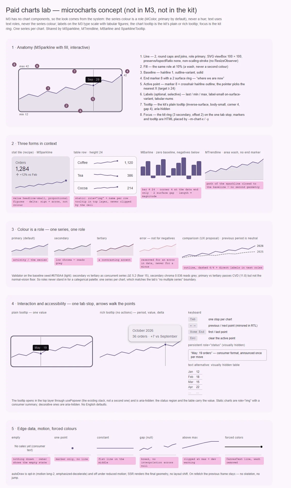

# Paid charts lab — микрографики как одна система геометрии, доступности и упаковки

<identity>M3: компонентов графиков нет. Вид выводится из системы: роли цвета (`MColor`, `outline-variant`, `surface`), типографика (`label-small`, `title-small`, `headline-small`, табличные цифры), фокус кита (`focus-ring`), тултипы plain и rich, движение `--sys-motion-*`, доступность · Токены Compose: графиков нет; тултип — `PlainTooltipTokens.kt`, `RichTooltipTokens.kt` (через план [tooltip](../components-should-update/overlays/tooltip.md)) · Код: нет (предлагается общая геометрия — чистые функции в `src/runtime/shared/utils/chart/` или в платном пакете, вопрос коммерческого условия; компоненты — по вопросу 1) · Аудит: нет · Тип: отдельная продуктово-архитектурная и коммерческая лаборатория (gap)</identity>

<implementation-status state="pending" updated="2026-10-07">Лаборатория вне активного roadmap, пока не утверждены продуктовая упаковка и технические границы. Статус прежнего плана сохранён: это не четыре несвязанных компонента, а одна поверхность геометрии, взаимодействия, доступности и коммерции. Условие продвижения: публичная упаковка, единый или раздельный API, общая геометрия, доступность и граница с charting-библиотекой утверждаются вместе. Коммерческое условие — ниже, отдельным разделом.</implementation-status>

## Вердикт

`нет в ките`, в M3 нет. Микрографики пришли из паритета с Vuetify (`VSparkline`). В лаборатории
четыре плана:
- [MSparkline](sparkline/index.md) — линия, кандидат в публичный фундамент;
- [SparklineTooltip](sparkline/tooltip.md) — приватный, зависимый;
- [MBarline](barline.md) — столбики;
- [MTrendline](trendline.md) — площадь.

Компонента графика в M3 нет, поэтому вид не копируется ни с Vuetify, ни с библиотеки, а
выводится из системы M3:
- **цвет ряда — роль, а не оттенок**: `color: MColor`, дефолт `primary`. Произвольный
  `gradient` из hex-цветов Vuetify отвергнут (`color-and-state.md`);
- **подписи и значения** — на типографике M3 цветом текста, никогда цветом ряда;
- **тултип** — plain или rich tooltip кита, а не свой пузырь;
- **фокус** — общее кольцо кита;
- **доступность** — текстовая альтернатива (таблица значений) и клавиатура по точкам.

Проверка, которой не было в прежнем плане: роли M3 как **одновременные** ряды не различаются.
Валидатор палитры на сиде `#6750A4` в светлой теме:
- `secondary` против `tertiary` — ΔE 5,2 при нормальном зрении, порог 15;
- хрома `secondary` — 0,036, читается серым;
- `primary` против `tertiary` — CVD-разделение есть (ΔE 11,8), но порог нормального зрения не
  пройден.

Это подтверждает отказ прежнего плана от нескольких рядов: **один ряд — одна роль**. Сравнение
с прошлым периодом — только нейтральным рядом (`outline`, пунктир, прямая подпись), см.
предложения по UX.

## Рендеры

| Сейчас | Концепт |
|---|---|
| — (нет в ките) |  |

Одна доска на всю лабораторию (`charts`), все планы ссылаются на неё. Кадры:
1. Анатомия спарклайна: линия 2, заливка-вуаль 10%, базовая линия, концевой маркер 8 с кольцом
   поверхности 2, подписи min / max / последнего значения, перекрестие.
2. Три формы в контексте: плитка показателя, строка таблицы, барлайн (зазор 2, угол 4 у конца
   данных, отрицательные — ниже нуля), трендлайн.
3. Цвет — роль: `primary` / `secondary` / `tertiary`; `error` только для ошибки, не для «минуса»;
   сравнение с прошлым периодом нейтральным рядом; результат валидатора.
4. Взаимодействие и доступность: одна остановка Tab, ←/→/Home/End по точкам, кольцо фокуса,
   plain-тултип и rich-тултип, постоянный статус, таблица значений.
5. Крайние данные: пусто, одна точка, константа, разрыв (`null`), значение за `max`; reduced
   motion; forced colors.

## Анатомия (общая для лаборатории)

| # | Часть | Предлагаемая реализация | Опора |
|---|---|---|---|
| 1 | Корень | `figure`; статичный — `role="img"` + имя; интерактивный — `role="group"` + имя, `tabindex="0"` | доступность |
| 2 | Плот | SVG `viewBox="0 0 100 100"`, `preserveAspectRatio="none"`, `vector-effect: non-scaling-stroke` — без `ResizeObserver` | граница фундамента (прежний план) |
| 3 | Метки (линия, площадь, столбики) | путь от общей геометрии; столбики — HTML flex с высотой в процентах, чтобы угол 4 не искажался | марки |
| 4 | Базовая линия | волосяная линия `outline-variant`, сплошная | система |
| 5 | Точки, перекрестие, якорь тултипа | HTML поверх плота по процентам: `--m-chart-x`, `--m-chart-y` — живая геометрия (`craft.md` §10) | `behavior.md` |
| 6 | Подписи (необязательно) | min / max / последнее значение: `label-small`, `on-surface-variant`, `tabular-nums` | типографика M3 |
| 7 | Тултип | приватный [SparklineTooltip](sparkline/tooltip.md): plain или rich tooltip кита | план tooltip |
| 8 | Текстовая альтернатива | визуально скрытая `<table>` значений + постоянный `role="status"` | WCAG 1.1.1 |

## Оси дизайна

| Ось | Значения | Комментарий |
|---|---|---|
| Форма | линия · площадь · столбики | один компонент с осью или три — вопрос 1; слово `type` запрещено (`axes.md`, ОВ-2) |
| `color` | `MColor`, дефолт `primary` | роль, не оттенок. `error` — только для ошибки данных, не для отрицательных значений |
| Режим | статичный · интерактивный · декоративный | статичный — `role="img"`; интерактивный — клавиатура и тултип; декоративный — `aria-hidden` |
| Высота | от контейнера | `density` не вводится: SVG масштабируется, толщины не масштабируются (`non-scaling-stroke`). Рекомендуемые высоты — в документации: строка таблицы 24, плитка 48 |
| Ряды | один | несколько рядов — граница библиотеки (прежний план); сравнение — только нейтральным рядом |

## Оси состояний

| Ось | Нужно | Как |
|---|---|---|
| Взаимодействие | rest · hover · focus · active point | перекрестие `outline` 1 + маркер 8 с кольцом `surface` 2 на активной точке; фокус — `focus-ring` кита на корне |
| Данные | пусто · одна точка · константа · разрыв · вне диапазона | пусто — ничего не рисуется, текст даёт потребитель; одна точка — только маркер; константа — линия посередине; `null` — разрыв без интерполяции; за `min`/`max` — обрезка и dev-предупреждение |
| Обновление | старый кадр держится | при рефетче прежняя геометрия остаётся, без скелетона и скачка |
| Движение | рисование — по желанию | `autoDraw` на `--sys-motion-duration-long-2` + `easing-emphasized-decelerate`; reduced motion — без анимации; SSR — финальный кадр |
| Forced colors | метки видны | линия и столбики — `CanvasText`, вуаль убирается, базовая — `GrayText` |
| RTL | время идёт по логическому направлению | ось X зеркалится, ←/→ по логике направления |

## Токены (общая карта `chart`)

| Часть | Значение | Токен `g()` |
|---|---|---|
| Линия | 2, скруглённые стыки и концы, роль `color` | `line.width`, `line.cap` |
| Вуаль площади | роль `color` на 10% | `area.opacity` (вопрос trendline) |
| Столбик | толщина до 24, угол `extra-small` 4 у конца данных, у базы прямой; зазор поверхности 2 | `bar.max`, `bar.shape`, `bar.gap` |
| Маркер | 8 (r 4), кольцо цвета `surface` 2 | `marker.size`, `marker.ring` |
| Базовая линия, перекрестие | 1, `outline-variant` / `outline` | `baseline.*`, `crosshair.*` |
| Подписи | `label-small` 11/16, `on-surface-variant`, `tabular-nums` | `label.*` |
| Нейтральный ряд сравнения | `outline`, пунктир 4/4 | `compare.*` (предложение по UX) |
| Цель указателя | ≥ 24 по X: ближайшая точка, а не попадание в линию 2 | поведение |
| Движение | `--sys-motion-duration-long-2`, `--sys-motion-easing-emphasized-decelerate` | `motion.*` |
| Тултип | карта `tooltip` (plain: `inverse-surface`, угол 4; rich: `surface-container`, угол 12, уровень 2) | без копии |

## Поведение и доступность

- **Слои `behavior.md`.**
  - Математика — чистые функции общей геометрии: нормализация, домен и база, точки,
    линейный и монотонный путь, столбики, замыкание площади, поиск ближайшей точки.
  - Над ней — `useChartControl`: активная точка, клавиатура, бэги атрибутов.
  - Сверху — презентация.
  - Копии SVG-математики в каждом компоненте нет (прежний план).
- **Одна остановка Tab** (прежний план). ←/→ — соседняя точка, Home/End — первая и последняя,
  Esc — снять активную. Указатель выбирает ближайшую по X, а не точку под пикселем.
- **Объявление.** Постоянный визуально скрытый `role="status"` получает «подпись: значение»
  через `format` потребителя. Тултип при этом `aria-hidden`: он визуальная копия.
- **Имя.** `ariaLabel` обязателен, иначе нужен явный декоративный режим (прежний план). Без
  обоих — dev-предупреждение. Английских дефолтов нет.
- **Текстовая альтернатива.** Визуально скрытая таблица «подпись — значение»: смысл никогда не
  несёт только рисунок (прежний план, WCAG 1.1.1).
- **Цвет — не единственный носитель.** Рост и падение — знаком, стрелкой и положением
  относительно базы, а не зелёным и красным.
- **Слушатели.** Указатель на корне через `useEventListener`, троттлинг `useRaf`. Без
  `ResizeObserver` для геометрии. Повторяющиеся графики не создают шторма наблюдателей,
  слушателей и таймеров (прежний план).
- **SSR.** Финальная геометрия в серверном HTML, без CLS. Анимация только по желанию.

## API (общая часть)

```ts
export interface MChartDatum {
  label: string          // для таблицы, тултипа и статуса
  value: number | null   // null — разрыв
}

interface MChartBaseProps {
  data: readonly MChartDatum[]        // только чтение, не v-model (прежний план)
  color?: MColor                      // 'primary'
  min?: number
  max?: number
  format?: (value: number) => string
  ariaLabel?: string
  decorative?: boolean                // флаг честен: второго значения нет
  autoDraw?: boolean
}
```

Модель активной точки — `v-model:active` (индекс или `null`) вместо события `hover(index)`. Формат
данных — вопрос 2.

## Граница с charting-библиотекой (прежнее решение)

Лаборатория покрывает микрографики без осей, легенд, зума, нескольких рядов, аннотаций и
сложных шкал. Когда такие требования появятся, подключаем настоящую библиотеку, а не растим свой
фреймворк. Новая зависимость — только с согласия владельца.

## Коммерческое условие (прежнее решение)

До реализации решить:
- какие утилиты остаются внутренними или в ядре;
- какие публичные компоненты входят в платный пакет;
- границы пакета и плагина;
- что видно в документации и демо;
- лицензирование;
- как кит ведёт себя, когда платного модуля нет.

## План работ (после продвижения)

1. **M — общая геометрия**: чистые функции и их unit-тесты. Ни одного компонента.
2. **M — `useChartControl`**: активная точка, клавиатура, статус, бэги; спека «без классов и
   `data-*`».
3. **S — карта `chart`** и SCSS-основа (линия, вуаль, маркер, база, подписи, forced colors).
4. **M — компоненты** по вопросу 1: линия ([sparkline](sparkline/index.md)), площадь
   ([trendline](trendline.md)), столбики ([barline](barline.md)).
5. **S — тултип** ([tooltip](sparkline/tooltip.md)) после шагов plain и rich плана tooltip.
6. **S — упаковка** по коммерческому условию: ядро против платного пакета, поведение без модуля.
7. **M — тесты и документация.**

## Тесты

- Unit: геометрия (домен, база ноль / min, константа, `null`, обрезка, монотонный путь без
  выброса за экстремумы, ближайшая точка); `useChartControl` (←/→/Home/End/Esc, статус, бэги без
  `class` и `data-*`).
- SSR: финальная геометрия в HTML, нет CLS, одинаковый путь на сервере и клиенте.
- e2e: одна остановка Tab на график; axe; таблица значений доступна скринридеру; forced colors;
  reduced motion; 100 графиков на странице без шторма слушателей (замер числа слушателей).

## Готово, когда

- [ ] Одна геометрия на все формы, копий математики нет.
- [ ] Цвет — только роль `MColor`; текст никогда не красится цветом ряда.
- [ ] Значение доступно без тултипа: таблица и статус.
- [ ] Клавиатура — одна остановка Tab и стрелки по точкам.
- [ ] Коммерческое условие и граница с библиотекой утверждены.

## Предложения по UX

Это предложения владельцу, а не шаги плана. Без Expressive-анимаций и без новых зависимостей.

| Предложение | Что получает пользователь | Заказчик | Цена | Рекомендация |
|---|---|---|---|---|
| Нейтральный ряд сравнения (`compare`): прошлый период пунктиром `outline` + прямая подпись | Видно «лучше или хуже, чем было», без второй роли цвета | плитки показателей | S · одна ветка токенов, проп данных | да |
| Плитка показателя как рецепт: подпись, значение (`headline-small`, пропорциональные цифры), дельта со знаком и стрелкой, спарклайн | Готовая форма для дашборда без отдельного компонента | дашборды | S · документация | да |
| Синхронное перекрестие для нескольких графиков через общий `v-model:active` | Наведение на март показывает март во всех плитках | дашборды | S · уже в API | да |
| Подсветка min и max маркерами с подписями | Экстремумы видны без наведения | финансовые ряды | S | обсудить |

## Открытые вопросы

**1. Один компонент или три (главный вопрос прежнего плана)?**
1. Один `MSparkline` с осью формы `mark: 'line' | 'area' | 'bar'` (не `type`, ОВ-2). Один
   контракт доступности, один экспорт.
2. Три компонента над одной геометрией: `MSparkline`, `MTrendline`, `MBarline`, как в прежних
   планах. Удобно продавать по отдельности, но три API на одно поведение.
3. Два: `MSparkline` (линия и площадь через `fill`) и `MBarline`. Площадь — это линия с
   заливкой, столбики — другая геометрия.

Рекомендация: 1 технически. Окончательно решает коммерческое условие (упаковка).

**2. Формат данных.**
1. Только записи `{ label, value }`. Подпись нужна таблице, тултипу и статусу. Голые числа
   отвергнуты в ките тем же доводом, что примитивы в `items` (`decisions.md`).
2. `number[]` и записи. Короче для декоративного случая, но интерактивный график без подписей
   скажет «точка 3: 42».
3. `number[]` + отдельный `labels: string[]`. Два массива, которые могут разойтись по длине.

Рекомендация: 1.

**3. Где живёт общая геометрия.**
1. В ядре (`shared/utils/chart/`), компоненты — в платном пакете. Ядро ничего не продаёт, а пакет
   тонкий.
2. Всё в платном пакете. Чистое разделение, но таблица или прогресс не смогут взять ту же
   математику.

Рекомендация: решает владелец вместе с коммерческим условием. Технически удобнее 1.
