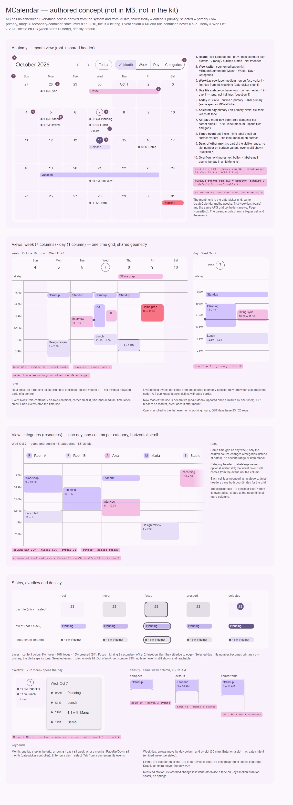

# MCalendar — календарь событий: месяц, неделя, день и категории (высокий приоритет, отложен)

<identity>M3: нет в M3; вид выводится из системы M3 и из Date pickers (сетка дней, «сегодня», выбор, диапазон) · Токены Compose: своих нет; опора — `DatePickerModalTokens.kt` (`DateContainerShape`, `DateToday*`, `DateSelected*`, полоса диапазона), `StateTokens.kt` · Код: нет (предлагается `src/runtime/components/ui/calendar/` + приватные виды [daily](daily.md), [weekly](weekly.md), [category](category.md), чистая логика в `src/runtime/composables/calendar/`) · Аудит: нет · Тип: public (корень) + sub (виды)</identity>

<implementation-status state="pending" updated="2026-10-07">Компонента нет. Отложен не потому, что неважен: приоритет высокий, отложенность означает зависимость. Календарь соединяет арифметику дат и диапазонов, локаль, часовые пояса и DST, нормализацию событий и геометрию наложений, реестры выбора и фокуса, прокрутку и виртуализацию, раскладку, жесты, оверлеи и SSR. Сделать его раньше, чем эти основания проверены вместе, — значит написать интеграционный тест в виде продакшен-архитектуры. Условие продвижения: владельцы оснований подписали предпосылки 1–8 (раздел «План работ», шаг 0), закрыты шаги 3–4 плана [date-picker](../../components-should-update/inputs/date-picker.md) (общая математика сетки и локаль), утверждено представление даты, времени и события (вопросы 3 и 4). Тогда все четыре плана семейства разворачиваются в финальные спецификации API, машины состояний и геометрии — до кода.</implementation-status>

## Вердикт

`нет в ките` — и нет в M3: это будущий авторский компонент. Вид выводится из системы M3 (роли
цвета, слой состояний, шкала форм, типографика, движение, доступность) и из `MDatePicker`:
«сегодня» — обводка 1 `primary`, выбранный день — `primary` / `on-primary`, выделенный
интервал — `secondary-container`, как полоса диапазона. Сетку месяца календарь не
изобретает заново: это та же математика и тот же клавиатурный контроллер, что у date-picker
(шаг 3 его плана), только с крупной ячейкой и событиями.

Прежний план (эпоха Vuetify `VCalendar`) переносится целиком: корень владеет видимым
диапазоном, видом, нормализованными событиями и категориями, интервалами, идентификаторами и
навигацией между видами. Приватные виды потребляют один контекст корня и общую геометрию
событий.

Не делаем (прежние отказы остаются):
- загрузку, кэш и сохранение событий;
- бэкенд повторений и интеграцию с провайдерами календарей, спрятанную в UI;
- переиспользование состояния `MDatePicker` там, где семантика календаря событий другая;
- непроверенное угадывание часового пояса;
- реализацию до прохождения ворот (шаг 0).

## Рендеры

| Сейчас | Концепт |
|---|---|
| — (нет в ките) |  |

Кадры концепта (сегодня — ср 7 окт 2026, en-US, неделя с воскресенья, плотность `default`):
1. Анатомия вида месяца: шапка, переключатель видов, дни недели, плитки дней, «сегодня»,
   выбранный день, многодневное событие, событие со временем, дни соседних месяцев, «+N ещё».
2. Неделя и день: одна сетка времени, полосы (lanes) для наложений, выделенный интервал,
   линия «сейчас». Подробно — [weekly](weekly.md), [daily](daily.md).
3. Категории: колонка на категорию, закреплённые шкала времени и шапка, горизонтальная
   прокрутка. Подробно — [category](category.md).
4. Матрица состояний плитки дня и события, раскрытие «+2 ещё» в меню, три ступени плотности,
   клавиатура.

## Анатомия

Вид месяца и общая шапка — части корня. Части сетки времени описаны в [daily](daily.md).

| # | Часть | Предлагаемая реализация | Источник |
|---|---|---|---|
| 1 | Шапка: период, «назад» / «вперёд», «Сегодня» | `title-large`; `MButtonIcon` (standard); `MButton` outlined; слот `#header` | вывод |
| 2 | Переключатель видов | `MButtonSegmented`: Month · Week · Day · Categories | вывод |
| 3 | Строка дней недели | `label-medium`, `on-surface-variant`; первый день — из локали (`Intl.Locale#weekInfo`, шаг 4 date-picker) | Date pickers |
| 4 | Плитка дня | `surface-container-low`, скругление `medium` 12, зазор 4; разделение тоном, а не линиями (вопрос 1) | craft §1 |
| 5 | Сегодня | круг 28 с обводкой 1 `primary`, номер `primary` | `DateToday*` |
| 6 | Выбранный день | номер на круге `primary` / `on-primary`; плитка сохраняет тон | `DateSelected*` |
| 7 | Событие на весь день и многодневное | полоса `<role>-container` / `on-<role>-container`, `small` 8, h20, `label-medium`; тянется через плитки и зазоры | вывод |
| 8 | Событие со временем | точка 8 цвета роли, время `label-small` `on-surface-variant`, название `label-medium` `on-surface` | вывод |
| 9 | Дни соседних месяцев | без плитки, номер `on-surface-variant`, события видны (вопрос 5) | вывод |
| 10 | «+N ещё» | текстовая кнопка `label-small`; открывает день в `MMenu` + `MList` | вывод |

## Оси дизайна

| Ось | Значения | Комментарий | Ломает API |
|---|---|---|---|
| `view` | `month \| week \| day \| category` | Состав первого релиза — архитектурный пункт «набор видов». `v-model:view` | новый компонент |
| `density` | `compact \| default \| comfortable` | Только три ступени (S5). Час: 40 / 48 / 64. Событий в дне месяца: 2 / 3 / 4. Шаг строки события ≥ 24 (WCAG 2.5.8) | — |
| Цвет события | `MColor` у события | Роль, а не оттенок (вопрос 2) | — |
| Локаль | `locale` | Первый день недели, форматы, цифры — через `Intl`, как у date-picker (его вопрос 6) | — |
| Границы | `minDate` / `maxDate` | Дни вне границ: номер 38 %, без слоя, события видны | — |
| Интервалы | `dayStart`, `dayEnd`, `slotMinutes` | Политика интервалов из прежнего плана; по умолчанию 0–24, 30 мин | — |
| Режим | `readonly` | Только просмотр: события активируются, создание и перенос выключены | — |
| `variant`, `shape`, `color` корня | — | Не вводить: у календаря одна обработка поверхности (В4) | — |

## Оси состояний

| Ось | Нужно | Не хватает (всё новое) |
|---|---|---|
| Базовое | enabled; readonly; день вне `minDate` / `maxDate` | `aria-disabled` у дня, фокусируемость сохраняется (как IN-08 date-picker) |
| Взаимодействие | hover и pressed слоем на плитке, интервале, событии (S1) | слой на `::before` цветом контента, `:hover` внутри `can-hover` |
| Фокус | кольцо `focus-ring`; у плиток — `inset` (стоят вплотную) | — |
| Выбор | выбранный день; выделенный интервал; выбранное событие | ветка `selected` (S9): день — круг `primary`, интервал — `secondary-container`, событие — заливка ролью |
| Навигация | «сегодня» с `aria-current="date"`; «сейчас» в сетке времени | `aria-current`; линия «сейчас» `aria-hidden` |
| Данные | события грузятся у потребителя | `aria-busy` на сетке, пока потребитель держит `loading`; пустой день ничего не рисует |
| Перетаскивание | только если вопрос 6 ≠ 1 | слой dragged 16 % + `elevation(+1)` |

## Токены (предлагаемая карта)

Новая карта `assets/stylesheet/components/calendar/_index.scss`, пути `g()` — через точку.
Значения дня, «сегодня» и выбора берутся из тех же ролей, что у date-picker, а не копируются
числами.

| Часть | Значение | Токен |
|---|---|---|
| Поверхность | `surface` (календарь — содержимое страницы, а не плавающая поверхность) | `container.color` |
| Период в шапке | `title-large`, `on-surface` | `header.title.*` |
| Дни недели | `label-medium`, `on-surface-variant` | `weekday.*` |
| Плитка дня | `surface-container-low`, `medium` 12, зазор 4 | `day.tile.color`, `day.tile.shape`, `day.tile.gap` |
| Номер дня | круг 28, `label-large`, `on-surface` | `day.number.*` |
| Сегодня | обводка 1 `primary`, номер `primary` | `day.today.*` |
| Выбранный день | `primary` / `on-primary` | `day.selected.*` |
| Дни соседних месяцев | номер `on-surface-variant`, плитки нет | `day.outside.*` |
| Событие-полоса | `<role>-container` / `on-<role>-container`, `small` 8, h20, `label-medium` | `event.bar.*` (по ролям `MColor`) |
| Шаг строки события | 24 (полоса 20 + 4) | `event.row` |
| Событие со временем | точка 8 `<role>`; время `label-small` `on-surface-variant` | `event.dot.*`, `event.time.*` |
| «+N ещё» | `label-small`, `on-surface-variant` | `more.*` |
| Событий в дне | 2 / 3 / 4 по `density` | `@each` по ступеням, без измерений |
| Состояния | 8 / 10 / 10 через `state-opacity()` | S1 |
| Фокус | `focus-ring`, на плитке `inset` | — |
| Движение | смена вида и периода — затухание `--sys-motion-duration-short4`, `easing-standard`; reduced motion — мгновенно | `motion.*`; без пружин (S4) |

Части сетки времени (час, шкала, линия «сейчас», блок события, выделение) — в [daily](daily.md).

## Поведение и доступность

- **Сетка месяца** — APG Grid (как Date Picker Dialog): одна точка табуляции, стрелки ±1 день
  и ±1 неделя через границу месяца, PageUp / PageDown ±1 месяц, Shift + Page ±1 год, Home /
  End — начало и конец недели. Контроллер — `useDateGridControl` из шага 3 date-picker; второй
  не заводим (behavior.md: «один контроллер на паттерн»).
- **События** — отдельный линейный порядок табуляции по времени начала: Tab из дня ведёт в его
  события. Событию не нужен пространственный вывод. Перетаскивание — дополнение, а не
  единственный путь.
- **ARIA**: сетка — `role="grid"` с `aria-labelledby` на период; заголовки дней —
  `columnheader` с полным названием; день — `gridcell` с `aria-selected` и
  `aria-current="date"` у сегодня; событие — кнопка с полным именем «Название, ср 7 окт,
  10:00–12:00» (формат через `Intl`); «+N ещё» — `aria-haspopup="menu"` + `aria-expanded`;
  период в шапке — `aria-live="polite"` при смене.
- **Переполнение** не измеряется: число видимых событий задаётся плотностью, поэтому
  серверный и клиентский HTML совпадают.
- **SSR**: роли и `aria-*` в серверном HTML. «Сегодня» и «сейчас» сервер не рисует, клиент
  ставит после монтирования — так же, как date-picker (EN-08). Идентификаторы детерминированы
  (`useId`).
- **Движение**: смена вида и периода — затухание на токенах; под reduced motion — мгновенно.
- **RTL**: логические свойства, шевроны зеркалятся, стрелки в сетке инвертируются.
- **Forced colors**: плитка без фона получает обводку `CanvasText`; полоса события — `ButtonText`;
  выбранное — `Highlight`; «сегодня» — обводка `CanvasText`.

## API

Кандидат из прежнего плана, переведённый на словарь кита. Точные поля ждут вопросов 3 и 4.

| Что | Кандидат |
|---|---|
| Модели | `v-model:date` (опорная дата, вопрос 3), `v-model:view`; событие `update:range` с видимым диапазоном |
| Данные | `events: MCalendarEvent[]` (`id`, `start`, `end`, `allDay?`, `title`, `color?: MColor`, `categoryId?`), `categories: { id, label }[]` |
| Настройки | `locale`, `timeZone` (вопрос 4), `minDate`, `maxDate`, `dayStart`, `dayEnd`, `slotMinutes`, `density`, `readonly` |
| Слоты | `#header`, `#day`, `#event`, `#interval`, `#category`, `#more` |
| События намерения | `select:date`, `activate:event`, `create` (интервал), `update:range`, `update:view`; сохранение — дело потребителя |
| Строки | `prevLabel`, `nextLabel`, `todayLabel`, `moreLabel` (шаблон «+{n}») — без английских дефолтов до ответа на общий вопрос Q13 |

**Архитектура, которую решает продвижение** (из прежнего плана, ничего не снято):

| Пункт | Где решается |
|---|---|
| Каноническое представление даты и времени, явная граница часового пояса | вопрос 4 |
| Модель «видимый диапазон» или «опорная дата» | вопрос 3 |
| Набор видов и входят ли месяц и категории в первый релиз | при продвижении; концепт рисует все четыре |
| Алгоритм полос для наложений и размещение событий на весь день | шаг 2: одна чистая функция для всех видов |
| Пороги виртуализации интервалов, категорий, событий | [category](category.md), вопрос 1 |
| Клавиатура: навигация по сетке, обход событий, возврат фокуса | раздел выше; возврат фокуса после меню — работа `MMenu` |
| Объём перетаскивания (создать, перенести, растянуть) и отделение readonly | вопрос 6 |
| Поведение на узкой ширине: прокрутка, другой вид или переключение потребителем | рекомендация: вид выбирает потребитель, кит его не меняет сам (как плотность — выбор, а не производная места, decisions.md); прокрутка — [weekly](weekly.md), вопрос 1 |
| Идентичность события, граница развёртки повторений, диагностика | `id` обязателен (как у `items` в ките); повторения разворачивает потребитель; dev-предупреждения о дублях `id` и `end < start` |

**Переиспользование** (прежний список, обновлён по коду): математика сетки и локаль из шагов 3–4
date-picker; `createContext` (`shared/utils/context/createContext.ts`); реестры
`composables/registry/*`; `useEventListener`, `useRaf`, `useTimer` (линия «сейчас»);
`useVirtualScroll` (уже есть, умеет `horizontal`); `useDrag`; `MButtonIcon`, `MButton`,
`MButtonSegmented`, `MMenu`, `MList`, `MAvatar` (шапка категории). Не создавать второй парсер
дат и локализацию, слой загрузки, глобальное хранилище событий (и Pinia-store) или сырые циклы
слушателей.

## План работ (после продвижения)

0. **Ворота** — до кода. Системные предпосылки из прежнего плана, каждая с тестами:
   1. примитивы дат проверены на локалях, границах недель, високосных годах, поясах и DST;
   2. жизненный цикл реестров и контекстов проверен на динамических и виртуализованных детях;
   3. прокрутка, rAF и виртуализация проверены на больших наборах интервалов и событий;
   4. арбитраж жестов указателя и очистка проверены в прокручиваемых сетках;
   5. наложение оверлеев, меню и поповеров и возврат фокуса проверены для событий;
   6. стратегия раскладки проверена без расхождения гидрации;
   7. токенная архитектура M3 проверена на плотных сетках данных и состояниях;
   8. паритет форматирования дат на сервере и клиенте и детерминированные `id` проверены.

   Плюс шаги 3–4 date-picker (`createCalendar`, `useDateGridControl`, локаль через `Intl`).
1. **M — модель диапазона.** `composables/calendar/createCalendarRange.ts`: чистые функции
   поверх `createCalendar`: видимый диапазон по виду, длина дня с учётом DST (23 / 25 часов),
   первый день недели. Без DOM.
2. **M — геометрия событий.** `composables/calendar/eventGeometry.ts`: нормализация, полосы
   для наложений, упаковка событий на весь день в строки. Одна функция для месяца, недели, дня
   и категорий: параллельный алгоритм, который может разъехаться, запрещён прежним планом.
3. **L — корень и вид месяца.** `components/ui/calendar/{index.vue,props.ts}`, контекст,
   шапка, сетка месяца через `useDateGridControl`, «+N ещё» через `MMenu` + `MList`, карта
   токенов. Зависимости: шаги 1–2, вопросы 1–5.
4. **M — общая сетка времени** для дня, недели и категорий: [daily](daily.md) шаги 1–2.
5. **S — вид недели** ([weekly](weekly.md)), **M — вид категорий** ([category](category.md)).
6. **M — клавиатура сетки времени**: control-композабл `useTimeGridControl` (бэги атрибутов,
   без классов и `data-*`).
7. **Перетаскивание** — только по ответу на вопрос 6.
8. **S — документация**: анатомия, таблица клавиш, рецепт загрузки событий у потребителя.

## Тесты

**Ворота из прежнего плана** — межфундаментные интеграционные тесты до финального плана: дни
DST, границы недель и лет, очистка динамического реестра, большие прокручиваемые сетки, отмена
указателя, фокус оверлея, SSR раскладки, reduced motion. Визуальные тесты календаря строятся на
их результатах, а не компенсируют нестабильные примитивы.

- **Unit**: `createCalendarRange` (DST, 5 ↔ 6 недель, первый день недели по локали);
  `eventGeometry` (полосы стабильны при перестановке входа, многодневные события через границу
  недели); `useTimeGridControl` на анонимной разметке без `class` и `data-*`.
- **Фикстуры** `playground/fixtures/calendar/`: `matrix.vue` (вид × плотность × readonly ×
  границы), `stress.vue` (200 событий в день, 50 категорий, локали `de-DE` / `ar-EG`, день DST).
- **e2e** (Playwright + axe): axe на каждом виде; таблица клавиш; «+N ещё» открывает меню и
  возвращает фокус; SSR без расхождения гидрации; forced colors; reduced motion.

## Готово, когда

- [ ] Ворота шага 0 пройдены, отчёт приложен к плану.
- [ ] Четыре вида рисуются из одного контекста и одной функции геометрии.
- [ ] Сетка месяца использует контроллер date-picker, своего нет.
- [ ] Клавиатура проходит таблицу, события достижимы без указателя.
- [ ] Серверный и клиентский HTML совпадают; «сегодня» и «сейчас» появляются после монтирования.
- [ ] Все значения — из карты токенов, пути `g()` через точку, `npm run lint:scss` чист.
- [ ] Ответы на вопросы 1–6 внесены, отказы записаны в `decisions.md` с условием возврата.

## Предложения по UX

Расширения сверх базового объёма. Это предложения владельцу, а не шаги плана. Без
Expressive-анимаций и без новых зависимостей.

| Предложение | Что получает пользователь | Заказчик | Цена | Рекомендация |
|---|---|---|---|---|
| Мини-месяц для навигации: `MDatePicker` в слоте `#aside`, связанный с `v-model:date` | Переход на дальнюю дату одним нажатием вместо листания | планировщики, бронирование | S · только слот и рецепт; отметки дней — через слот `#day` date-picker (его предложение 3) | да |
| Вид «повестка» (`view: 'agenda'`): список дней с событиями на `MList` | На телефоне читается лучше сжатой недели | мобильные экраны | M · новый член `view`, своя виртуализация списка | обсудить при продвижении |
| Рабочие часы: `workingHours`, нерабочее время тоном `surface-container-low`, открытие на начале рабочего дня | Видно, когда встреча неудобна; меньше прокрутки | корпоративные календари | S · проп + токен | да |
| Горячие клавиши: T — сегодня, D / W / M — вид, J / K — период, через `useHotkey` | Быстрая навигация для частых пользователей | диспетчеры, ресепшен | S · без нового механизма | обсудить: клавиши не должны мешать вводу в слотах |

## Открытые вопросы

**1. Чем отделять дни в виде месяца?**
1. Тоном и формой: плитки `surface-container-low`, скругление 12, зазор 4 (концепт). Следует
   craft §1, но на светлой теме плитки слабо различимы на `surface`.
2. Волосяной сеткой `outline-variant` 1, как в привычных календарях. Читается сразу, но это
   именно та линия внутри контрола, от которой craft предостерегает.
3. Без разделения: только номера и события на `surface`. Самое лёгкое, но неделя хуже читается
   по вертикали.

Рекомендация: 1. Линии остаются только в сетке времени как шкала чтения (см. [daily](daily.md)).

**2. Цвет событий.**
1. Только роли `MColor` (`primary | secondary | tertiary | error`) в двух обработках: полоса
   `<role>-container`, точка `<role>`. Остаётся в системе ролей, но цветов четыре.
2. Плюс произвольный цвет события (`color: string`), из которого тема строит контейнер.
   Различимо любое число категорий, но это оттенок, а не роль (color-and-state.md), и контраст
   не гарантирован.
3. Роли + слот `#event` для своих отметок: кит рисует роли, потребитель с палитрой рисует сам.

Рекомендация: 3. `error` — только для событий-ошибок, не для «важного».

**3. Модель видимого периода.**
1. `v-model:date` — опорная дата; диапазон выводится из вида и отдаётся событием
   `update:range`. Одна правда, но диапазон только для чтения.
2. `v-model:range` (`{ start, end }`). Удобно для загрузки событий, но для месяца диапазон не
   произволен, и правило «что значит неделя с середины» придётся придумывать.
3. Обе модели. Гибко, но две правды могут разойтись.

Рекомендация: 1. Потребитель грузит события по `update:range`.

**4. Представление даты, времени и часового пояса.**
1. `Date` или ISO-строка с офсетом в событиях, проп `timeZone` (IANA), арифметика через dayjs с
   плагинами `utc` и `timezone` (входят в уже подключённый dayjs, новой зависимости нет).
   Детерминированный SSR, но нужен проп.
2. Всё в поясе браузера, без пропа. Проще, но сервер считает в своём поясе — расхождение
   гидрации и неверный «сегодня» у пользователей в других поясах.
3. `Temporal` с полифилом. Правильная модель, но это новая зависимость.

Рекомендация: 1; ответ согласовать с вопросом 6 date-picker (форматирование через `Intl`).

**5. Дни соседних месяцев в виде месяца.**
1. Рисовать как часть видимого диапазона: без плитки, номер `on-surface-variant`, события видны
   (концепт). Шесть недель событий реальны, и многодневная полоса не обрывается на границе.
2. Пустые ячейки, как рекомендует date-picker (его вопрос 2). Единообразно с пикером, но
   событие 30 сентября в неделе октября пропадает.

Рекомендация: 1. Календарь показывает диапазон событий, пикер — месяц выбора; это разные задачи.

**6. Объём перетаскивания в первом релизе.**
1. Без перетаскивания: создание выделением интервала (клик или клавиатура), перенос — через
   форму потребителя. Ноль жестов, всё доступно с клавиатуры.
2. Только перенос события (`useDrag`, отмена по Esc). Средняя цена, нужен арбитраж с прокруткой
   (предпосылка 4).
3. Создание, перенос и растягивание. Полный опыт, L, самый рискованный для тача.

Рекомендация: 1 в первом релизе, 2 — отдельным шагом после ворот.
