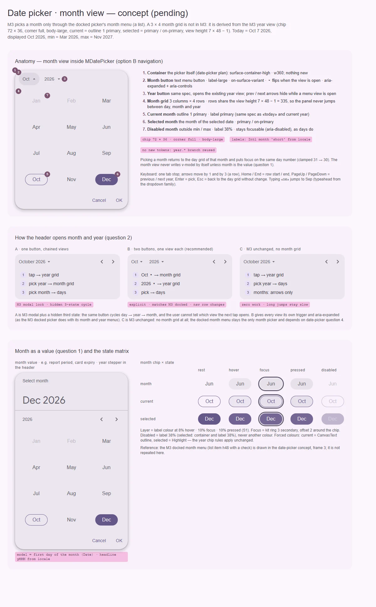

# DatePickerMonths — вид выбора месяца внутри MDatePicker (отложен до продуктовой потребности)

<identity>M3: Date pickers — выбор месяца в M3 есть только у docked-пикера (меню месяцев списком); сетки месяцев в M3 нет, она выводится из вида годов · Токены Compose: `DatePickerModalTokens.kt` (`SelectionYear*`, `DateToday*` для обводки текущего), высота вида — `DatePicker.kt` (`RecommendedSizeForAccessibility × (MaxCalendarRows + 1) − 1` = 335) · Код: нет (предлагается приватный `src/runtime/components/fragments/date-picker/month-grid/` рядом с `day-grid` и `year-grid`) · Аудит: нет (части пикера — `data/date-picker.json`) · Тип: sub, приватный вид `MDatePicker`</identity>

<implementation-status state="pending" updated="2026-10-07">Нет. В ките уже есть полноценный `MDatePicker` с видами дней и годов (`header-nav`, `day-grid`, `year-grid`), локализованной логикой дат и навигацией в пределах min/max. Отдельная сетка месяцев сейчас не закрывает подтверждённую задачу, поэтому расширять машину видов и шапку ради паритета с `VDatePickerMonths` нецелесообразно. Условие продвижения не изменилось: появился реальный сценарий, где листать месяцы неудобно — выбор месяца без дня, быстрый переход к далёкому месяцу или сценарий «сначала месяц». До реализации решить вопрос 1; режим «месяц как значение» нельзя маскировать под простой приватный лист. Зависит от шагов 3–4 плана [date-picker](../components-should-update/inputs/date-picker.md).</implementation-status>

## Вердикт

`нет в ките`. Выбор месяца — часть M3 Date pickers, но только в docked-варианте: кнопка «Oct ▾»
открывает меню-список из двенадцати месяцев с галочкой. Этот вид нарисован в концепте
date-picker (кадр 3) и зависит от его вопроса 4 (нужен ли docked). У модального пикера M3
выбора месяца нет: меню «October 2026 ▾» открывает только сетку лет.

Сетка месяцев 3 × 4 — вывод кита, а не цифра M3. Она собирается из готовой ветки годов: чип
72 × 36, скругление full, `body-large`, текущий — обводка 1 `primary`, выбранный —
`primary` / `on-primary`, высота вида 7 × 48 − 1. Новых чисел в карте нет.

## Рендеры

| Сейчас | Концепт |
|---|---|
| — (нет в ките) |  |

Кадры концепта (сегодня — 7 окт 2026, отображается октябрь 2026, min — март 2026, max —
ноябрь 2027):
1. Анатомия: вид месяцев внутри `MDatePicker` при двух кнопках шапки (вариант 2 вопроса 2), семь
   частей с выносками, правила возврата и клавиатура.
2. Три способа открыть месяц и год из шапки (вопрос 2): цепочка через одну кнопку, две кнопки,
   M3 без сетки месяцев.
3. Месяц как значение (вопрос 1): пикер «Select month» с переключателем года в шапке; матрица
   состояний чипа месяца.

## Анатомия

| # | Часть | Предлагаемая реализация | Источник |
|---|---|---|---|
| 1 | Контейнер | сам `MDatePicker`: поверхность, ширина и actions — из плана date-picker | Date pickers |
| 2 | Кнопка месяца | текстовая кнопка-меню `label-large`, `on-surface-variant`, ▾ переворачивается; `aria-expanded` + `aria-controls` | M3 docked |
| 3 | Кнопка года | та же спека, открывает существующий вид годов; стрелки прячутся, пока открыт вид | M3 docked / modal |
| 4 | Сетка месяцев | 3 колонки × 4 строки; строки делят высоту вида 335, панель не прыгает между днями, месяцами и годами | вывод из вида годов |
| 5 | Текущий месяц | обводка 1 `primary`, текст `primary` | `DateToday*` |
| 6 | Выбранный месяц | месяц выбранной даты, `primary` / `on-primary` | `SelectionYearSelected*` |
| 7 | Недоступный месяц | вне min / max: текст 38 %, остаётся фокусируемым (`aria-disabled`) | IN-08 date-picker |

## Оси дизайна

| Ось | M3 | Кит сейчас | Цель | Ломает API |
|---|---|---|---|---|
| Вид навигации | calendar · year (+ меню месяцев в docked) | `ViewMode = 'calendar' \| 'year'` (`composables/date/index.ts`) | `calendar \| month \| year`, один `displayDate` | нет, вид приватный |
| Форма вида месяцев | список в docked | — | сетка в модальном и встроенном пикере, список — только в docked (вопрос 3) | нет |
| Значение | день | день | день; месяц как значение — вопрос 1 | да, если вопрос 1 = 2 |
| Подписи | — | — | `Intl.DateTimeFormat(locale, { month: 'short' })`: короткие формы помещаются в 72 на любой локали | нет |
| Плотность | нет | нет | не вводить (как у date-picker) | нет |

## Оси состояний

| Ось | Нужно |
|---|---|
| Базовое | enabled; недоступен вне min / max (фокусируем, не выбирается) |
| Взаимодействие | hover и pressed слоем (S1), как у чипа года |
| Фокус | `focus-ring` вокруг чипа со смещением 2 |
| Выбор | выбранный месяц; текущий месяц с `aria-current` |
| Раскрытие | кнопка месяца с `aria-expanded`, вид — `aria-controls` |

## Токены

Своей ветки с числами нет: вид месяцев читает ветку `year` единой карты date-picker (шаг 2 его
плана) — `year.width` 72, `year.height` 36, форма full, `body-large`, роли текущего и
выбранного. Новое — только раскладка:

| Часть | Значение | Токен |
|---|---|---|
| Сетка | 3 × 4, строки `1fr` в высоте вида | `month.columns`, `month.rows` |
| Высота вида | 7 × 48 − 1 = 335 (общая с видом годов) | `view.height` |
| Подпись | `body-large`, `on-surface-variant` | из `year.*` |
| Движение | смена вида — `expandVertically` + затухание у M3; у кита — токены `--sys-motion-*`, без пружин (S4) | `motion.*` date-picker |

## Поведение и доступность

- **Клавиатура** (APG Grid, потребитель `useDateGridControl` из шага 3 date-picker, третьего
  контроллера нет): одна точка табуляции; ← / → ±1, ↑ / ↓ ±3 (строка); Home / End — начало и
  конец строки; PageUp / PageDown — предыдущий и следующий год; Enter / Space — выбрать; Esc —
  назад к дням без изменений. Набор «se» переходит к сентябрю — `useTypeahead` из семейства
  дропдауна.
- **Фокус**: при открытии — на отображаемом месяце. После выбора — вид дней этого месяца, фокус
  на том же числе (31 → 30). `v-model` вид месяцев не пишет, если месяц не значение (вопрос 1).
- **ARIA**: сетка — `role="grid"` с `aria-labelledby` на подпись года; чип — `gridcell` с
  `aria-selected`; текущий — `aria-current="date"`; недоступный — `aria-disabled="true"`.
- **SSR**: обводку текущего месяца, как и «сегодня», ставит клиент (EN-08 date-picker).
- **Forced colors**: текущий — обводка `CanvasText`, выбранный — `Highlight`, как у чипа года.

## API

| Что | Изменение | Ломает |
|---|---|---|
| Вид | внутренний `ViewMode` расширяется до `'calendar' \| 'month' \| 'year'` | нет |
| Шапка | `header-nav` получает две кнопки-меню или остаётся с одной — вопрос 2 | видимое |
| Значение месяца | публичный API только если вопрос 1 = 2 | да |
| Слот | `#month="{ month }"` по образцу `#year` из шага 5 date-picker | нет |

Переиспользование (из прежнего плана): `MDatePicker`, фрагменты `header-nav`, `day-grid`,
`year-grid`, `useDatePicker`. Не создавать отдельное состояние дат, парсер, конвейер локали
или второй API пикера.

## План работ (после продвижения)

1. **S — вид в машине видов.** `composables/date/index.ts`: `month` в `ViewMode`, переходы
   по вопросу 2, один `displayDate`. Зависимость: шаг 3 date-picker.
2. **S — фрагмент `month-grid`.** Разметка на `useDateGridControl`, ветка `year` карты
   токенов, подписи через `Intl`. Зависимость: шаги 2 и 4 date-picker.
3. **S — шапка.** Кнопки-меню с `aria-expanded` по вопросу 2.
4. **M — месяц как значение** — только если вопрос 1 = 2: отдельный публичный компонент поверх
   тех же фрагментов.
5. **S — документация и фикстура** `playground/fixtures/date-picker/matrix.vue` получает ось
   «вид месяцев».

## Тесты

- Unit: переходы видов без скрытого цикла; клампинг дня при возврате; недоступные месяцы
  фокусируемы и не выбираются; подписи для `ru-RU`, `de-DE`, `ar-EG`.
- e2e: таблица клавиш, фокус при открытии и после выбора, axe на виде месяцев, высота пикера
  одинакова на трёх видах, forced colors.

## Готово, когда

- [ ] Вид месяцев не добавил ни одного числа в карту токенов.
- [ ] Каждый вид открывается своей кнопкой (или по ответу на вопрос 2), `aria-expanded` верен.
- [ ] Высота панели не меняется между днями, месяцами и годами.
- [ ] Ответ на вопрос 1 записан; при «нет» отказ от месяца-значения лежит в `decisions.md` с
      условием возврата.

## Предложения по UX

Сверх паритета; решает владелец. Без новых зависимостей.

| Предложение | Что получает пользователь | Заказчик | Цена | Рекомендация |
|---|---|---|---|---|
| Набор названия месяца с клавиатуры (`useTypeahead`) | Переход к «сентябрю» тремя буквами | формы с дальними датами | S · композабл уже есть | да, вместе с шагом 2 |
| Диапазон месяцев «с — по» для отчётов | Период отчёта выбирается в одном виде, без дней | аналитика, бухгалтерия | M · модель `[start, end]`, полоса `secondary-container` как у range date-picker | только после вопроса 1 = 2 и вопроса 5 date-picker |
| Отметки на месяцах через слот `#month` (число событий, точка) | Видно, где есть данные, до выбора | отчёты, архивы | S · только слот | да, слот дёшев |
| Пресеты «Этот месяц», «Прошлый месяц» над сеткой | Частый выбор одним нажатием | фильтры отчётов | S · слот `#presets` из предложения date-picker | вместе с пресетами date-picker |

## Открытые вопросы

**1. Месяц — значение или только навигация?** (прежний пункт «decision-needed» 2)
1. Только навигация: приватный вид внутри `MDatePicker`, значение остаётся днём. Минимум API.
2. Месяц как значение: отдельный публичный компонент (рабочее имя `MMonthPicker`, модель — первое
   число месяца как `Date`) поверх тех же фрагментов. Закрывает срок карты и период отчёта, но
   это новый публичный компонент.
3. Ось на `MDatePicker`, переключающая единицу значения. Один компонент, но тип модели и смысл
   OK начинают зависеть от пропа, а слово `mode` уже занято (`picker | input`).

Рекомендация: 1 сейчас; 2 — когда появится заказчик (В4).

**2. Как шапка открывает месяц и год?** (прежний пункт 3: без скрытого цикла из трёх состояний)
1. Одна кнопка «October 2026 ▾» и цепочка: годы → месяцы → дни. Вид как у модального M3, но
   третье состояние скрыто: пользователь не знает, что откроет следующее нажатие.
2. Две кнопки «Oct ▾» и «2026 ▾», у каждой свой вид и свой `aria-expanded` (как в docked M3).
   Явно, но строка навигации модального пикера меняется.
3. M3 без изменений: сетки месяцев нет, месяцы листаются стрелками, годы — меню. Ноль работы,
   дальний переход остаётся медленным.

Рекомендация: 2.

**3. Форма вида месяцев.**
1. Сетка 3 × 4 из ветки годов во встроенном и модальном пикере; список с галочкой — только в
   docked, если вопрос 4 date-picker = «да». Каждая подача получает форму своего соседа по виду.
2. Список, как в docked M3, везде. Одна форма, но список из 12 строк по 48 выше вида дней и
   требует прокрутки.
3. Сетка везде, включая docked. Одна форма, но docked расходится с M3.

Рекомендация: 1.
