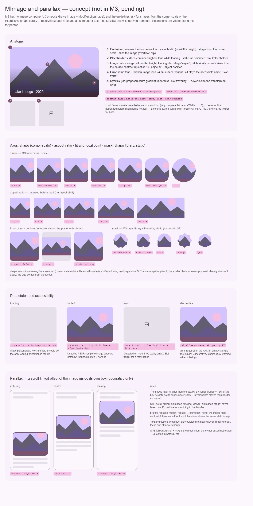

# MImage — изображение с зарезервированным местом, формой и состояниями загрузки (отложено до архитектуры источников)

<identity>M3: нет в M3 — есть гайдлайны по изображениям (форма из шкалы скруглений или библиотеки фигур Expressive, зарезервированные пропорции, скрим под текстом); в Compose это `Image` + `Modifier.clip(shape)` · Токены Compose: своих нет; роли — `ColorSchemeKeyTokens` (`SurfaceContainerHighest`, `OnSurfaceVariant`, `Scrim`), формы — `ShapeKeyTokens`, библиотека — `MaterialShapes.kt` · Код: нет (предлагается `src/runtime/components/ui/image/` + общий помощник состояния загрузки в `src/runtime/composables/image/`) · Аудит: нет · Тип: public</identity>

<implementation-status state="pending" updated="2026-10-07">Нет. Полезный компонент больше обёртки над ``: его долговечный контракт зависит от решений про интеграцию с Nuxt (плагин или модуль), провайдеров изображений, imgProxy, фабрик источников, трансформаций, генерации адаптивных источников, кэша и границ безопасности. Сделать маленькую обёртку первой — значит заморозить несовместимые пропы и продублировать будущий конвейер. Условие продвижения (прежнее): контракты провайдера и плагина, прокси и фабрики, SSR и безопасности рассмотрены вместе (вопрос 1). Тогда план разворачивается в полную спецификацию, и решается, нужны ли инфраструктуре отдельные планы. Рабочее имя сменилось: прежний план звал компонент `MImg` по образцу Vuetify.</implementation-status>

## Вердикт

`нет в ките` — и компонента нет в M3, только гайдлайны. Вид выводится из системы:
- форма — ступень шкалы скруглений (`MShape`), по умолчанию `none`: углы задаёт хост (карточка,
  список, карусель);
- место резервируется до загрузки (`aspect-ratio` или `width` / `height`) — нет сдвига раскладки;
- пока картинки нет — тон `surface-container-highest`, без мерцающего скелета;
- ошибка — тот же тон и иконка `broken_image` 24 `on-surface-variant`;
- силуэт из библиотеки фигур Expressive — отдельная ось `mask`, статичная (морф S3 отклонён).

Главный разрыв не визуальный, а архитектурный: откуда берутся `src` и `srcset` (вопрос 1).

Не делаем (прежние отказы):
- склейку URL строками в SFC;
- скрытую загрузку и клиентский store кэша;
- трансформации и кэш внутри компонента — они остаются за выбранной экосистемой провайдера;
- обязательного проприетарного провайдера;
- разрешение источника только на клиенте, меняющее SSR-разметку;
- ранний публичный API до утверждения границ плагина, фабрики и imgProxy.

## Рендеры

| Сейчас | Концепт |
|---|---|
| — (нет в ките) |  |

Доска общая с [parallax](parallax.md). Иллюстрации — векторные заглушки вместо фотографий.
1. Анатомия: контейнер, плейсхолдер, изображение, ошибка, оверлей со скримом (предложение UX).
2. Оси: шкала скруглений, пропорции, `fit` и точка фокуса, маска из библиотеки фигур.
3. Состояния данных и доступность: загрузка, загружено, ошибка, декоративное.
4. Параллакс — см. [parallax](parallax.md).

## Анатомия

| # | Часть | Предлагаемая реализация | Статус |
|---|---|---|---|
| 1 | Контейнер | резервирует место (`aspect-ratio` или `width` / `height`), форма из шкалы, `overflow: clip` | нет |
| 2 | Плейсхолдер | тон `surface-container-highest`, статичный; слот `#placeholder` | нет |
| 3 | Изображение | нативный ``: `alt`, `width` / `height`, `loading`, `decoding="async"`, `fetchpriority`, `srcset` / `sizes` из контракта источника; `object-fit` + `object-position` | нет |
| 4 | Ошибка | тон + иконка 24 `on-surface-variant`; имя — `alt`; слот `#error` | нет |
| 5 | Оверлей | скрим и текст поверх — предложение UX, вне ядра | нет |

## Оси дизайна

| Ось | Значения | Комментарий | Ломает API |
|---|---|---|---|
| `shape` | `MShape` — шкала скруглений, по умолчанию `none` | смысл из axes.md: только скругление | новый компонент |
| `mask` | имя фигуры `MShape` (`9SidedCookie`, `4LeafClover`, `arch`…) | силуэт — другое измерение, чем `shape` (вопрос 2); то же касается предложения «clover» в плане [avatar](../components-should-update/data/avatar.md) | — |
| `aspectRatio` | число или строка `'16 / 9'` | резервирует место; без него — `width` / `height` | — |
| `fit` | `cover \| contain` | `contain` показывает тон плейсхолдера по краям | — |
| `position` | строка `object-position` (точка фокуса) | кадрирование при `cover` | — |
| `loading`, `fetchpriority` | нативные значения | первый экран — `eager` + `high` | — |
| `density`, `variant`, `color` | — | не применимо: размер задаёт раскладка, обработки поверхности нет | — |

## Оси состояний

| Ось | Нужно |
|---|---|
| Данные | загрузка → загружено / ошибка; ошибка, случившаяся до гидрации, тоже ловится |
| Движение | появление — затухание `--sys-motion-duration-short4` только если картинка догрузилась после гидрации; из кэша и SSR — сразу; reduced motion — без затухания |
| Доступность | информативное (`alt` с текстом) · декоративное (`alt=""`) · ошибка с именем |
| Взаимодействие | нет: картинка не интерактивна; кликабельную картинку оборачивает хост (карточка, кнопка) со своим слоем состояния |

## Токены (предлагаемая карта)

Новая карта `assets/stylesheet/components/image/_index.scss`, пути `g()` через точку.

| Часть | Значение | Токен |
|---|---|---|
| Плейсхолдер | `surface-container-highest` | `placeholder.color` |
| Иконка ошибки | 24, `on-surface-variant` | `error.icon.size`, `error.icon.color` |
| Форма по умолчанию | `none` | `shape` |
| Появление | `short4`, `easing-standard` | `motion.fade.*` |
| Скрим оверлея (предложение) | `scrim` 0 → 56 % | `overlay.scrim.*` |

## Поведение и доступность

- Семантика — у нативного ``: компонент не прячет её за `div` с фоном.
- `alt` обязателен в API (вопрос 3); пустая строка — явный выбор «декоративное», такая картинка
  пропускается скринридером.
- При ошибке `` скрыт, контейнер получает `role="img"` и `aria-label` из `alt`: имя не
  теряется (та же дыра — A11-05 в плане avatar).
- Ошибка до гидрации: при монтировании проверяется `img.complete && naturalWidth === 0`. Это тот
  же шаг, что ST-01 / CT-09 у avatar; помощник общий (`useImageStatus`), а не две копии.
- Ленивая загрузка — нативный `loading="lazy"`. `MLazy` и `useIntersectionObserver` (VueUse уже в
  зависимостях) — только если нативного поведения или провайдера не хватит (прежнее правило).
- SSR: `src`, `srcset`, `sizes`, `width`, `height` одинаковы на сервере и клиенте. Состояние
  «загружено» сервер не знает, поэтому плейсхолдер — фон контейнера под картинкой, а не
  условная разметка.
- Forced colors: плейсхолдер теряет фон — контейнер получает обводку `CanvasText`, иконка
  ошибки — `CanvasText`.

## API

Кандидат. Поля источника не утверждены и выводятся из ответа на вопрос 1, а не копируются из
Vuetify или Nuxt Image.

| Что | Кандидат |
|---|---|
| Пропы | `src` (`MImageSource`), `alt` (обязателен), `width`, `height`, `aspectRatio`, `fit`, `position`, `shape`, `mask` (вопрос 2), `loading`, `fetchpriority`, `sizes` |
| Слоты | `#placeholder`, `#error` |
| События | `load`, `error` |

```ts
// Прежняя граница семантики и транспорта — сохранена как кандидат, не утверждена.
type MImageSource = string | MImageSourceDescriptor

interface MImageSourceDescriptor {
  src: string
  width?: number
  height?: number
  format?: string
  quality?: number
  modifiers?: Record<string, string | number | boolean>
}
```

**Архитектура к решению** (из прежнего плана, ничего не снято):
- владеет ли кит плагином или модулем изображений, или только провайдер-нейтральным компонентом;
- контракт провайдера и фабрики для URL источников и описаний трансформаций;
- интеграция imgProxy: подпись, разрешённые источники, паритет URL на сервере и клиенте;
- адаптивные `srcset` / `sizes`: ширины, форматы, качество, DPR;
- совместимость с нативным `` и Nuxt Image, поведение без настроенного провайдера;
- ленивая загрузка, preload и `fetchpriority`, decoding, политика первого экрана;
- плейсхолдер (цвет, размытие, хэш) и поведение источника ошибки;
- ключи кэша и инвалидация, остаётся ли кэш целиком за провайдером;
- безопасность и приватность удалённых URL, атрибуты `referrerpolicy` и `crossorigin`.

**Зависимый компонент:** [parallax](parallax.md) обязан переиспользовать итоговый контракт
источника, провайдера и геометрии, а не заводить параллельный API изображения.

## План работ (после продвижения)

0. **Ворота:** ответ на вопрос 1 и совместное ревью контрактов провайдера, прокси и фабрики,
   SSR и безопасности. Решить, нужны ли отдельные планы инфраструктуры.
1. **S — общий помощник `useImageStatus`** (`composables/image/`): загрузка, ошибка, ранняя
   ошибка при монтировании. Сразу же потребитель — `MAvatar` (закрывает его ST-01 / CT-09).
2. **M — `MImage`**: контейнер, плейсхолдер, ошибка, оси `shape`, `aspectRatio`, `fit`,
   `position`, карта токенов, forced colors.
3. **M — шов источника** по вопросу 1 (адаптер через `provide` / `inject`, по образцу
   `ValidationAdapter`, или фабрика в пропе).
4. **S — `mask`** по вопросу 2: SVG `clipPath` из `M3_SHAPES`, общий с avatar.
5. **S — документация**: политика первого экрана, `alt`, рецепт с провайдером.

## Тесты

- Unit: ранняя ошибка (мок `complete` и `naturalWidth`) даёт состояние ошибки; `role="img"` и
  имя при ошибке; затухания нет, если картинка уже загружена при монтировании; `alt=""` не
  даёт имени.
- Фикстуры `playground/fixtures/image/`: `matrix.vue` (форма × пропорции × `fit` × состояние),
  `stress.vue` (битый URL, очень широкая и очень высокая картинка, 200 картинок в ленте).
- e2e: нет сдвига раскладки (CLS = 0 при загрузке), axe, forced colors, reduced motion.

## Готово, когда

- [ ] Ответ на вопрос 1 утверждён; источник не склеивается строками в SFC.
- [ ] Место зарезервировано до загрузки, сдвига раскладки нет.
- [ ] Ошибка ловится и до гидрации; имя не теряется; у avatar тот же помощник.
- [ ] Серверный и клиентский HTML совпадают.
- [ ] Значения из карты токенов, `npm run lint:scss` чист.

## Предложения по UX

Сверх базового объёма; решает владелец. Без новых зависимостей и без Expressive-анимаций.

| Предложение | Что получает пользователь | Заказчик | Цена | Рекомендация |
|---|---|---|---|---|
| Оверлей `#overlay` со скримом для текста поверх картинки | Подпись читается на любой фотографии | герои страниц, карточки, карусель | S · слот + токен; цвет текста на скриме: у M3 нет роли `on-scrim`, нужен выбор — постоянный белый или `inverse-on-surface` | да, с решением о цвете текста |
| Плейсхолдер доминантного цвета из метаданных провайдера (`placeholderColor`) | Меньше «серых дыр» в ленте до загрузки | ленты, каталоги | S · проп; blurhash не делать — нужен декодер (зависимость) | да, после вопроса 1 |
| `<figure>` + `figcaption` через слот `#caption` | Подпись семантически связана с картинкой | статьи, документация | S · слот | да |
| Арт-дирекшн: `<picture>` с источниками по брейкпойнтам кита | На телефоне другой кадр, а не уменьшенный | маркетинговые страницы | M · проп `sources`, брейкпойнты из `$material-kit-breakpoints` | обсудить после вопроса 1 |
| Просмотр в полный размер по нажатию (лайтбокс на `MDialog`) | Деталь фото без ухода со страницы | каталоги, отзывы | L · отдельный компонент | отдельный план, не в `MImage` |

## Открытые вопросы

**1. Граница архитектуры источников.** (прежний главный вопрос)
1. Провайдер-нейтральный компонент + шов: `src` / `srcset` строками или фабрика
   `(width) => url`, которую приложение отдаёт через `provide` (как `ValidationAdapter`). Кит не
   знает imgProxy, подпись живёт на сервере приложения. Малый объём, без зависимостей.
2. Свой Nuxt-модуль кита с провайдерами (imgProxy с подписью, разрешённые источники, кэш).
   Полный конвейер, но это инфраструктура, ключи и безопасность внутри UI-кита.
3. Интеграция с `@nuxt/image` как необязательный peer, по образцу адаптера vee-validate. Готовые
   провайдеры, но новая (пусть необязательная) зависимость и её API в наших типах.

Рекомендация: 1 сейчас; шов спроектировать так, чтобы адаптер 3 подключался позже без смены
пропов.

**2. Маска из библиотеки фигур в первом релизе.**
1. Только шкала скруглений `shape`. Минимум, но выразительные аватары и обложки в духе Expressive
   остаются рецептом.
2. Плюс `mask` — статичная фигура из `M3_SHAPES` через SVG `clipPath`. Дёшево (пути уже в ките),
   решается одновременно для avatar.
3. Маска через сам `MShape`. Один источник фигур, но `MShape` тянет движок морфа и пружины
   (`useShapeMorph`), которые картинке не нужны.

Рекомендация: 2 одной задачей с avatar; не через `MShape`.

**3. Как требовать `alt`.**
1. `alt: string` обязателен в типе пропов; `''` — явное «декоративное». Ошибка типа ловит
   пропуск до запуска.
2. Необязателен, dev-предупреждение при отсутствии (как лейбл у `MOtpInput`). Мягче, но
   пропуск доезжает до продакшена.
3. Флаг `decorative: boolean` рядом с `alt`. Читается явно, но это второй способ сказать одно и
   то же (craft §2).

Рекомендация: 1.
