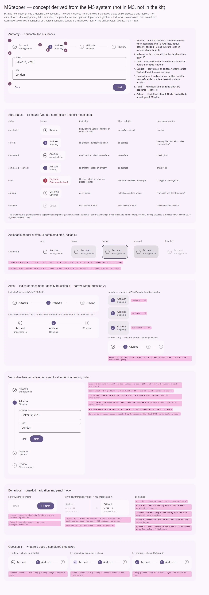

# MStepper — пошаговый сценарий: шаги со статусами, панели шагов и действия «Назад / Далее»

<identity>M3: нет в M3 (был в Material 2: horizontal и vertical stepper). Вид выводится из системы M3: роли цвета (таблица ролей в `color-and-state.md` прямо называет «шаги»), слой состояния, шкала форм, типографика, переход shared axis · Токены Compose: своих нет; опора — `ListTokens` (отступы 16, зазор 12, высоты строк, форма large 16), `CheckboxTokens` (обводка 2), `DividerTokens` (толщина 1), `BadgeTokens` (ошибка `error` / `on-error`), `PrimaryNavigationTabTokens` (подпись `title-small`), `MotionTokens` · Код: нет (предлагается `src/runtime/components/ui/stepper/`, композаблы `composables/stepper/{createStepper,useStepperControl}.ts`, приватные части: [item](item.md), [actions](actions.md), [vertical](vertical.md), [vertical-item](vertical-item.md), [vertical-actions](vertical-actions.md), [window](window.md), [window-item](window-item.md)) · Аудит: нет · Тип: public, родитель семейства</identity>

<implementation-status state="pending" updated="2026-10-07">Архитектура одобрена раньше как data-driven оркестратор сценария, фаза 4. Реализация закрыта двумя условиями. Первое: основа [MWindow](../window/index.md) реализована и стабильна. Второе: общее состояние корня проверено интеграционными тестами guard и фокуса в обоих рендерах, горизонтальном и вертикальном. К ним добавляются ответы владельца на вопросы 1–4 этого плана. План переведён в формат M3 без изменения одобренной архитектуры.</implementation-status>

## Вердикт

`нет в ките`. В M3 степпера тоже нет: он был в Material 2, из M3 его убрали. Значит, компонент
авторский, и его вид выводится из системы M3, как у вердикта `авторский` (`common.md` §3), а не
копирует Material 2. Главные выводы:

- **Заливка индикатора означает «вы здесь», и залит только текущий шаг.** `primary` в ките
  принадлежит одной активности (`color-and-state.md`). Статус несёт глиф и текст: номер, галочка,
  «!» с сообщением, подпись «Необязательно». Так состояние не выражается одним цветом.
- **Геометрия заголовка взята у строки списка.** Отступ 16, зазор 12, высоты по плотности,
  форма слоя large 16. Тело вертикального шага стоит на отступе 52, как подзаголовок списка.
- **Панели переключает `MWindow`.** Переход — shared axis X: M3 называет этот паттерн для
  пошаговых сценариев.

Прежние решения сохранены: data-driven сценарий, одно состояние на оба рендера, guard-функции, без
движка валидации. Нецели прежнего плана: движок валидации, хранилище формы, мастер на маршрутах,
модель-индекс, двойной DOM под брейкпойнт.

## Рендеры

| Сейчас | Концепт |
|---|---|
| — (нет в ките) |  |

Кадры концепта:

1. **Анатомия** горизонтального степпера на поверхности: заголовок, индикатор, заголовок шага,
   подзаголовок, коннектор, панель, действия.
2. **Статусы шага**: не начат, текущий, завершён, завершён и текущий, ошибка, необязательный,
   отключён. Для каждого показаны роли индикатора и текста и нецветовой носитель.
3. **Заголовок × состояние** у завершённого редактируемого шага: rest, hover, focus, pressed,
   disabled.
4. **Оси**: `indicatorPlacement` `start` и `top`; плотность (вопрос 4); узкая ширина (вопрос 2).
5. **Вертикальный степпер**: рейка на оси индикаторов, тело активного шага на отступе 52, локальные
   действия.
6. **Поведение**: ожидание `beforeChange`, переход панелей shared axis, семантика.
7. **Вопрос 1**: какая роль у завершённого шага.

## Анатомия

| # | Часть | Выведено из | Предлагаемая реализация |
|---|---|---|---|
| 1 | Корень: `ol`, своей поверхности нет, стоит на поверхности потребителя | — | `stepper/index.vue` |
| 2 | Заголовок шага: `li`; кнопка только у шага, на который можно перейти. Высота 72 (две строки, `default`), отступ 16, зазор 12, слой `on-surface`, форма large 16 | `ListTokens`: `ItemLeadingSpace` 16, `ItemBetweenSpace` 12, высоты 56 / 72; статичная форма слоя large (S3 без морфа) | [item.md](item.md), [vertical-item.md](vertical-item.md) |
| 3 | Индикатор 24, форма full. Номер `label-medium`, глиф 16 | шкала форм; обводка 2 — `CheckboxTokens.UnselectedOutlineWidth` | [item.md](item.md) |
| 4 | Заголовок шага `title-small` | подпись вкладки M3 | [item.md](item.md) |
| 5 | Подзаголовок `body-small` `on-surface-variant`. Несёт «Необязательно» и сообщение ошибки | supporting text строки списка | [item.md](item.md) |
| 6 | Коннектор: 1, `outline-variant`; после завершённого шага `outline`; отступ 8 от заголовков | `DividerTokens.Thickness` 1, таблица ролей | горизонталь — [item.md](item.md), вертикаль — рейка [vertical.md](vertical.md) |
| 7 | Панель: элемент `MWindow`, отступ по блоку 24; `id` панели связан с `id` заголовка | — | [window.md](window.md), [window-item.md](window-item.md) |
| 8 | Действия: «Назад» (`MButton` text) в начале, «Далее» или «Готово» (`MButton` filled) в конце, зазор 8 | действия диалога M3 | [actions.md](actions.md), [vertical-actions.md](vertical-actions.md) |

## Оси дизайна

| Ось | Значения | Откуда | Ломает API |
|---|---|---|---|
| `layout` | `horizontal \| vertical`, дефолт `horizontal` | прежнее одобренное `MStepperLayout`; то же слово, что у `MToolbar.layout` и `MTimePicker.layout` | — (нового API нет) |
| `indicatorPlacement` | `start \| top`, дефолт `start`; только для `horizontal` | слово `<x>Placement` (`axes.md`), как `iconPlacement` в плане tabs | — |
| `density` | `compact \| default \| comfortable` — заимствуется `MFieldDensity`, как у `MListItemDensity` | S5; вопрос 4 | — |
| `color`, `variant`, `shape` | не вводятся | роли заданы статусом, своей поверхности нет, форма фиксирована | — |

## Оси состояний

| Ось | Нужно | Нецветовой носитель |
|---|---|---|
| Статус шага | `pending` · `current` · `complete` · `error` · `optional` · `disabled`, плюс сочетание «завершён и текущий» | номер · заливка и `aria-current="step"` · галочка · «!» и сообщение · подпись «Необязательно» · нативный `disabled` |
| Взаимодействие заголовка | rest, hover, focus, pressed, disabled — только у шага, на который можно перейти | кольцо фокуса 3 `secondary` |
| Навигация | `navigating` на время `beforeChange` или `beforeComplete` | `loading` на запустившей кнопке, повторные запросы заблокированы |
| Раскрытие (вертикаль) | видно только тело активного шага; сохранённые тела `hidden` + `inert` | положение в DOM |
| Валидация | работа потребителя: поля `error` и `complete` в элементах и guard-функции | сообщение в подзаголовке |
| Данные | пустой `items`: ничего не рисуется, dev-предупреждение; элементы меняются на лету | — |
| Движение | переход панелей shared axis; reduced motion | — |

Приоритет статуса остаётся прежним: disabled › error › complete › current › pending. В концепте
он разложен на два канала (вопрос 3). Глиф берётся по приоритету, а заливка показывает текущий шаг;
если у шага ошибка, заливку берёт она.

## Токены (новая карта)

Карта — `assets/stylesheet/components/stepper/_index.scss`, пути `g()` точечные.

| Часть | Значение | Откуда | Токен |
|---|---|---|---|
| Высота заголовка | одна строка 44 / 56 / 64, две строки 60 / 72 / 80 (`compact` / `default` / `comfortable`) | `ListTokens` + плотность `MListItemDensity` | `density.<d>.height.one`, `.two` |
| Отступ и зазор заголовка | 16 / 12 | `ItemLeadingSpace`, `ItemBetweenSpace` | `header.padding.inline`, `header.gap` |
| Форма слоя заголовка | large 16, статично | `ItemFocused/PressedContainerExpressiveShape` | `header.shape` |
| Слой состояния | `on-surface`, `state-opacity(hover / focus / pressed)` | слой списка; pressed — S1 | `header.state.color` |
| Индикатор | 24, full, обводка 2 | — / `CheckboxTokens` | `indicator.size`, `indicator.shape`, `indicator.border.width` |
| Не начат | обводка `outline-variant`, номер `on-surface-variant` | таблица ролей: «пусто» | `indicator.pending.*` |
| Завершён | обводка `outline`, галочка `on-surface` (вопрос 1) | таблица ролей: «содержимое есть» | `indicator.complete.*` |
| Текущий | заливка `primary`, содержимое `on-primary` | таблица ролей: «активно» | `indicator.current.*` |
| Ошибка | заливка `error`, глиф `on-error` | `BadgeTokens.LargeColor` / `LargeLabelTextColor` | `indicator.error.*` |
| Номер и глиф | `label-medium`; глиф 16 | — | `indicator.label`, `indicator.icon.size` |
| Заголовок шага | `title-small`; `on-surface`, до шага — `on-surface-variant`, ошибка — `error` | подпись вкладки | `title.*` |
| Подзаголовок | `body-small`, `on-surface-variant`; ошибка — `error` | supporting text | `subtitle.*` |
| Коннектор | 1; `outline-variant`, после завершённого шага `outline`; отступ 8; минимум 16 | `DividerTokens` | `connector.*` |
| Вертикаль: тело | отступ 52 = 16 + 24 + 12; по блоку 8 / 24 | inset подзаголовка списка | `vertical.body.*` |
| Панель | по блоку 24 | — | `panel.padding.block` |
| Действия | зазор 8 | — | `actions.gap` |
| Disabled | собственные цвета шага × `state-opacity(disabled-content)` | `color-and-state.md` | — |
| Движение панелей | у `MWindow` | — | — |

## Поведение и доступность

Слои по `behavior.md`:

1. Чистая машина `createStepper`: нормализованные шаги, порядок, достижимость, линейные правила,
   приоритет статуса, версии запросов.
2. Control-композабл `useStepperControl`: бэги `rootAttrs`, `getHeaderAttrs(value)`,
   `getPanelAttrs(value)`, атрибуты действий, перевод фокуса. Без классов и `data-*`.
3. Презентация — компоненты семейства.

**Навигация** (прежнее решение). Каждый запрос проверяет disabled, границы и линейные правила,
ждёт `beforeChange`, потом записывает модель. Пока guard не ответил, стоит `navigating` и повторы
блокируются. Ответ `false` или отклонение оставляют активную панель; отклонение эмитит
`navigation-error`. Порядок «вперёд / назад» берётся из нормализованных включённых значений и
никогда не предполагает числовую модель.

**Линейность** (прежнее решение). Назад можно на любой достижимый шаг. Прямой переход вперёд
требует, чтобы все предыдущие обязательные шаги были завершены. Обычное «Далее» идёт на один
включённый шаг. Необязательный шаг не блокирует, отключённый пропускается, но не считается
завершённым. `editable=false` отключает только переход по заголовкам.

**Завершение** (прежнее решение). На последнем шаге «Готово» ждёт `beforeComplete`. Успех эмитит
`complete` и оставляет модель как есть, `false` сохраняет состояние, отклонение эмитит
`navigation-error`. Отправка сценария — работа потребителя.

**Доступность** (прежнее решение, с уточнениями):

- Список шагов упорядоченный (`ol` / `li`). У текущего заголовка `aria-current="step"`.
- Кнопка у заголовка есть, только если на шаг можно перейти. Текущий шаг, шаг при
  `editable=false`, отключённый шаг и шаг, закрытый линейностью, — не кнопки: без слоя и вне
  обхода Tab.
- Заголовок и панель связаны парой `id`. Степпер — не `tablist`: роли вкладок и roving-фокус не
  выдумываются, Tab обходит доступные заголовки.
- После успешной навигации действием фокус уходит на заголовок нового шага. Фокус на поле с
  ошибкой — работа потребителя.
- Статус озвучивается текстом в имени заголовка: «Шаг 2 из 4, Адрес, ошибка: карта отклонена».
  Слова статуса берутся из пропов с запасными строками в `MESSAGES`.
- **Forced colors.** Обводка и заливка индикатора переопределяются системными цветами: текущий —
  `Highlight` и `HighlightText`, остальные — обводка `CanvasText`. Глифы остаются.
- **RTL.** Логические свойства. Коннекторы и ось перехода зеркалятся.
- **Движение.** В горизонтали переход панелей — у `MWindow`: shared axis X. В вертикали тело
  шага раскрывается на месте, как `MExpansionPanel`: высота на `medium-2`. При reduced motion
  смещения нет, остаётся только затухание или смена высоты на `short-1`: кит укорачивает движение,
  а не выключает его.

**SSR и жизненный цикл** (прежнее решение). Нет автоматической смены раскладки по брейкпойнту:
нет двойного DOM и прыжка при гидрации. Асинхронные guard-функции версионируются, устаревший ответ
не записывается. Тикеты контекста снимаются при `onScopeDispose`. Серверный HTML уже несёт
`aria-current`, `id` и `disabled`.

**Отличие от соседей.** Если нужно только показать этап процесса, без панелей и навигации, это
`MTimeline` с отметкой «сейчас» (предложение плана
[timeline](../../components-should-update/data/timeline/index.md)), а не степпер. Пошаговый режим
формы ([form-renderer](../../components-should-update/form/form-renderer.md), «Предложения по UX»)
ждёт этот компонент.

## API

Прежний одобренный контракт сохранён:

```ts
interface MStepperItem<TValue> {
  value: TValue
  title: string
  subtitle?: string
  optional?: boolean
  complete?: boolean
  error?: boolean
  disabled?: boolean
  icon?: string
  completeIcon?: string
  errorIcon?: string
}
type MStepperLayout = 'horizontal' | 'vertical'
type StepperChangeReason = 'next' | 'prev' | 'item' | 'model'
type StepperBeforeChange<T> = (event: { from?: T, to: T, direction: 'forward' | 'backward', reason: StepperChangeReason }) => boolean | Promise<boolean>
```

| Что | Значение | Статус |
|---|---|---|
| `items` + резолверы | типизированные элементы | прежнее |
| `v-model` | `TValue` активного шага | прежнее |
| `layout` | дефолт `horizontal` | прежнее |
| `linear`, `editable` | дефолты `true`, `true` | прежнее |
| `disabled` | весь сценарий | прежнее |
| `mount` | политика `MWindow`, дефолт `visited` | прежнее; имя оси — вопрос 1 плана [window](../window/index.md) |
| `beforeChange`, `beforeComplete` | guard-функции | прежнее |
| Эмиты | `complete`, `navigation-error` | прежнее |
| Слоты | метка шага, панель, действия, `previous`, `next`, `complete`; получают нормализованный шаг, границы, `navigating` и безопасные методы запроса. Слот не может обойти guard и записать выбор окна напрямую | прежнее |
| `indicatorPlacement` | `start \| top` | новое, аддитивное |
| `density` | `MFieldDensity` | новое, вопрос 4 |
| `previousLabel`, `nextLabel`, `completeLabel`, `optionalLabel`, `errorLabel` | пропы с запасными строками `MESSAGES.stepper*`, как `incrementLabel` у number-input | уточнение прежнего «localized action labels» |

Ломающих изменений нет: компонента ещё нет.

## План работ (после продвижения)

1. **M — машина `createStepper`.** Нормализация, порядок, достижимость, линейные правила, приоритет
   статуса, версии запросов. Чистые функции и unit-тесты. Файл
   `composables/stepper/createStepper.ts`.
2. **M — `useStepperControl`.** Бэги атрибутов, пары `id`, перевод фокуса, спека на анонимной
   разметке (без `class` и `data-*`).
3. **M — горизонтальный рендер.** Корень, [StepperItem](item.md), [StepperWindow](window.md) и
   [StepperWindowItem](window-item.md), [StepperActions](actions.md), карта токенов. Зависит от плана
   [window](../window/index.md).
4. **M — вертикальный рендер.** [StepperVertical](vertical.md),
   [StepperVerticalItem](vertical-item.md), [StepperVerticalActions](vertical-actions.md). Тесты
   паритета состояния с горизонталью.
5. **S — `indicatorPlacement="top"` и узкая ширина** (вопрос 2).
6. **S — плотность** (вопрос 4).
7. **S — документация и решения.** Когда степпер, когда вкладки, когда timeline. Записать нецели в
   `decisions.md`.

Зависимости: `MWindow`; `MButton` с `loading` (есть); S1 (pressed); S8 не требуется — высота
заголовка не ниже 44.

## Тесты

- **Фикстуры** `playground/fixtures/stepper/`:
  - `matrix.vue`: `layout` × `indicatorPlacement` × статусы × плотность;
  - `stress.vue`: 12 шагов, длинные заголовки, 320 px, RTL, вставка и удаление шагов на лету,
    медленный и отклоняющий guard.
- **e2e** `stepper.e2e.ts`: axe в обоих рендерах; Tab обходит только доступные заголовки; фокус
  после «Далее»; гонка guard-функций; forced colors (текущий шаг различим); reduced motion; RTL.
- **Unit**: `createStepper` (линейность, необязательные и отключённые шаги, `editable`, версии
  запросов); бэги `useStepperControl` без `class` и `data-*`; SSR-разметка несёт `aria-current`,
  `id` и `disabled`.

## Готово, когда

- [ ] Одно состояние корня ведёт оба рендера; паритет подтверждён тестами.
- [ ] Ни один статус не выражается только цветом; залит только текущий шаг (по ответу на вопрос 1).
- [ ] Guard-функции блокируют повторы, устаревший ответ не записывается, отклонение даёт
      `navigation-error`.
- [ ] Шаги, на которые нельзя перейти, — не кнопки; фокус после навигации на новом заголовке.
- [ ] Панели переключаются через `MWindow` без второго пути навигации.
- [ ] axe, линтеры (`lint`, `lint:style`, `lint:scss`) и e2e зелёные; SFC не длиннее 400 строк.

## Предложения по UX

Сверх паритета. Это предложения владельцу, а не шаги плана. Без Expressive-анимаций и без новых
зависимостей.

| Предложение | Что получает пользователь | Заказчик | Цена | Рекомендация |
|---|---|---|---|---|
| Переход к первому шагу с ошибкой, если `beforeComplete` вернул ошибки: метод `goToFirstError()` в слоте действий | Не нужно искать, где сломалось, — степпер ведёт к шагу и фокусирует его заголовок | длинные формы, онбординг | S · API: метод в слоте, без нового состояния | да |
| Пошаговый режим `MFormRenderer`: секции конфигурации становятся шагами, `beforeChange` проверяет поля секции через адаптер валидации | Длинная форма идёт кусками с проверкой на каждом шаге | [form-renderer](../../components-should-update/form/form-renderer.md) (там предложение отложено «до stepper») | M · рецепт или адаптер в плане form-renderer, степпер не знает о валидации | да, после шага 4 |
| Синхронизация шага с URL (`?step=address`): рецепт поверх `v-model` и `useRoute` | Перезагрузка и «назад» в браузере не теряют место в сценарии | онбординг, оформление заказа | S · бандл 0 · рецепт в доках | рецептом |
| Сводка введённого в подзаголовке завершённого шага: слот `#subtitle` с данными шага | Проверить ответы можно, не возвращаясь на шаг | оформление заказа | S · слот | да |

## Открытые вопросы

**1. Какая роль у завершённого шага?** (кадр 7 концепта)
1. Обводка `outline` и галочка `on-surface`. Таблица ролей говорит: «содержимое есть» — это
   `outline`, а `primary` — только активность. Цена: «сделано» читается по глифу, а не по пятну цвета.
2. Заливка `secondary-container` и галочка `on-secondary-container`. «Сделано» видно сразу. Цена:
   цвета нет в таблице ролей (`principles.md` В3: это выбор, а не назначение).
3. Заливка `primary`, как в Material 2. Цена: залиты все пройденные шаги, и «вы здесь» теряется;
   нарушает правило «`primary` — только активность».

Рекомендация: 1.

**2. Горизонтальный степпер на узкой ширине.**
1. Видна только подпись текущего шага, у остальных — индикаторы. Тот же DOM, скрытые подписи
   остаются для AT; порог — container query по `inline-size` (по высоте нельзя, `decisions.md`).
   Цена: правило CSS и порог в токенах.
2. Ряд заголовков прокручивается по горизонтали, как scrollable-вкладки, текущий шаг в зоне
   видимости. Цена: часть шагов скрыта за краем, нужен замер прокрутки.
3. Ничего не делать: документация советует `layout="vertical"` на узких экранах. Цена: ряд
   выдавливает контейнер, если потребитель не переключил раскладку.

Рекомендация: 1. Автоматическая смена раскладки по брейкпойнту не предлагается: она противоречит
прежнему решению «без двойного DOM».

**3. Два канала статуса или один?**
Прежний план задал один приоритет статуса: disabled › error › complete › current › pending. По нему
вернувшийся на завершённый шаг пользователь видит «завершён», и «вы здесь» не показано ничем.
1. Два канала: глиф по прежнему приоритету, заливка — текущий шаг (ошибка забирает заливку).
   Порядок статусов не меняется, добавляется независимый признак. Цена: у индикатора пять видов
   вместо четырёх.
2. Один канал, как в прежнем плане. «Вы здесь» передают только `aria-current` и вес подписи.
   Цена: зрячий пользователь теряет текущий шаг среди завершённых.

Рекомендация: 1.

**4. Плотность в первой версии.**
1. Заимствовать `MFieldDensity`, как `MListItemDensity`: заголовок 44 / 56 / 64 в одну строку и
   60 / 72 / 80 в две. Степпер стоит в формах, и его заголовки совпадают с полями той же
   плотности. Цена: `@each` по трём ступеням в Sass.
2. Без плотности до появления пошагового режима form-renderer (`principles.md` В4: нет
   заказчика — нет оси). Цена: в компактной форме степпер крупнее полей.

Рекомендация: 1.
