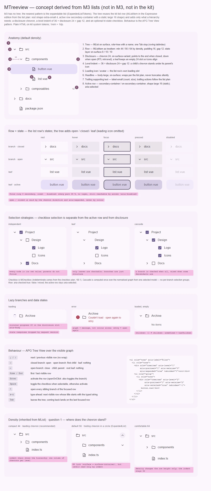

# MTreeview — иерархический список: раскрытие ветвей, активная строка, выбор с каскадом, ленивые дети

<identity>M3: нет в M3. Ближайшее — expandable-список Expressive (`ExpandedListTokens`: шеврон в круге `surface` → `surface-container`) и строки Lists; вид выводится из строки списка M3 · Токены Compose: `ListTokens.kt`, `ExpandedListTokens.kt` (в Compose 1.5 есть только токены, реализации нет), `CheckboxTokens.kt` (глиф выбора) · Код: нет (предлагается `src/runtime/components/ui/treeview/` + приватные [children](children.md), [group](group.md), [item](item.md); композаблы `composables/treeview/{createTreeGraph,createTreeSelection,useTreeviewControl}.ts`) · Аудит: нет · Тип: public, родитель семейства</identity>

<implementation-status state="pending" updated="2026-10-07">Отложен до проверки архитектуры и взаимодействия. Дерево совмещает несколько непростых механизмов: неизменяемую рекурсивную нормализацию, три независимых управляемых состояния (раскрыто, выбрано, активно), каскадный выбор с промежуточным состоянием, ленивую загрузку детей, фокус клавиатуры по видимому графу и вложенную ARIA. Реестры списка и выбора помогают, но не решают ни родословную, ни тройное состояние, ни фокус после рекурсивных изменений. Условие продвижения (прежнее): одобрены граф и типы, семантика трёх моделей, правила каскада, политика ленивых запросов и кэша, полное поведение фокуса и расширение семантики `MListItem`. Новые условия: закрыты вопросы 1–3 этого плана; в плане [list](../../components-should-update/containment/list.md) сделан шаг 3 (семантика и «роль задаёт владелец»); в плане [checkbox](../../components-should-update/form/checkbox.md) сделан ЧВ-1 (indeterminate). После этого все четыре файла семейства разворачиваются в спецификации реализации вместе.</implementation-status>

## Вердикт

`нет в ките`. В M3 дерева тоже нет, так что компонент авторский по системе M3 (`common.md` §3).
Главный вывод: **дерево — это строка списка кита плюс то, что нужно иерархии, и не больше.** Своего
вида строки у дерева нет.

Строка — `MListItem` в редакции, которую выбирает план
[list](../../components-should-update/containment/list.md):

- рекомендация вопроса 2 этого плана — Expressive: покой xs 4, выбранная large 16 статично;
- цвет выбора — `secondary-container` по вопросу 1 того же плана;
- плотность, слой состояний и disabled по частям — как у списка.

Дерево добавляет:

- шеврон раскрытия;
- отступ уровня 36 = шеврон 24 + зазор 12, чтобы шеврон ребёнка стоял под иконкой родителя;
- глиф выбора с промежуточным состоянием;
- клавиатуру APG Tree View.

Прежние решения сохранены: data-driven `items`, три независимые модели, одна мастер-модель
контекста без контекстов на ветвях и без обхода DOM, рекурсивный DOM в v1, виртуализация —
отдельным режимом позже.

## Рендеры

| Сейчас | Концепт |
|---|---|
| — (нет в ките) |  |

Кадры концепта:

1. **Анатомия**: дерево на поверхности, строка, шеврон, отступ 36, иконка, заголовок, счётчик,
   активная строка.
2. **Строка × состояние**: закрытая ветвь, открытая ветвь, лист, активный лист × rest, hover,
   focus, pressed, disabled.
3. **Стратегии выбора**: `independent`, `leaf`, `cascade` с промежуточным состоянием.
4. **Ленивые ветви**: загрузка, ошибка, загружено и пусто.
5. **Поведение**: клавиатура APG и ARIA-разметка.
6. **Плотность** (от `MList`) и **вопрос 1**: где стоит шеврон.

## Анатомия

| # | Часть | Выведено из | Предлагаемая реализация |
|---|---|---|---|
| 1 | Дерево: `MList` на поверхности, `role="tree"` с именем, одна остановка Tab | `ListTokens.ContainerShape` | `treeview/index.vue` |
| 2 | Строка: `MListItem` в роли `treeitem` | `ListTokens` (высоты, отступы, слой) | [item.md](item.md) |
| 3 | Шеврон раскрытия 24, `on-surface-variant`; закрытая ветвь — к концу строки, открытая — вниз; у листа пустой слот 24 | `ListTokens.ItemLeadingIconColor`; вопрос 1 | [item.md](item.md) |
| 4 | Отступ уровня 36 = 24 + 12 | `ItemBetweenSpace` 12 | [children.md](children.md) |
| 5 | Иконка или аватар | `#leading` строки | слот |
| 6 | Заголовок `body-large` | `ItemLabelTextFont` | слот `#headline` |
| 7 | Счётчик или размер `label-small` | `ItemTrailingSupportingTextFont` | слот `#trailingSupporting` |
| 8 | Активная строка: `secondary-container`, large 16 | `ItemSelectedContainerColor`, `ItemSelectedContainerExpressiveShape` | состояние `selected` строки |
| 9 | Глиф выбора 18 (необязателен) | `CheckboxTokens` | вопрос 2 |
| 10 | Группа детей `role="group"` | — | [group.md](group.md), [children.md](children.md) |

## Оси дизайна

| Ось | Значения | Откуда | Комментарий |
|---|---|---|---|
| `density` | наследуется от `MList` (`MListItemDensity`): строка 44 / 56 / 64 | `axes.md`: ось одолжена у полей | отступ уровня от плотности не зависит |
| `selection` | `false \| 'independent' \| 'leaf' \| 'cascade'`, дефолт `false` | прежние стратегии; флаг «выбор есть» свёрнут в ось (`principles.md` В1, как `controls` у number-input) | — |
| `openStrategy` | `'multiple' \| 'single'`, дефолт `'multiple'` | прежнее «single / multiple open strategy» | `single` закрывает соседей при открытии |
| `openOnClick` | `boolean`, дефолт `false` | прежнее | клик по строке активирует; по шеврону — раскрывает |
| `color`, `variant`, `shape` | не вводятся | вид — у строки списка | — |

## Оси состояний

| Ось | Значения | Нецветовой носитель |
|---|---|---|
| Раскрытие | закрыта · открыта · лист | направление шеврона, `aria-expanded` |
| Загрузка детей | загрузка · ошибка · загружено пусто | индикатор вместо шеврона, `aria-busy` · глиф и сообщение · строка «Нет элементов» |
| Активность | одна активная строка | форма large 16, `aria-selected` |
| Выбор | не отмечен · отмечен · частично (`cascade`) | глиф галочки или черты, `aria-checked` true / false / mixed |
| Взаимодействие | rest, hover, focus, pressed, disabled — у строки списка | кольцо фокуса 3 `secondary` |
| Фокус | один сфокусированный узел (roving), не равен активному | — |
| Данные | пустое дерево → `#empty` (из плана list) | — |

## Токены (новая карта)

Строка читает карту `list/item`. Карта дерева — `assets/stylesheet/components/treeview/_index.scss` —
держит только добавления, пути точечные.

| Часть | Значение | Откуда | Токен |
|---|---|---|---|
| Отступ уровня | 36 = `disclosure.size` + `padding.between` строки | вывод: шеврон ребёнка под иконкой родителя | `level.indent` (вычисляется в Sass из двух токенов) |
| Уровень строки | живое значение `--m-treeview-level` | структурная живая геометрия; глубина не ограничена, классы на каждый уровень не генерируются | — |
| Шеврон | 24, `on-surface-variant`; поворот 90° у открытой ветви | `ListTokens.ItemLeadingIconColor` | `disclosure.size`, `disclosure.color` |
| Поворот шеврона | `short-3`, `standard`; reduced motion — `short-1` | как шеврон `MExpansionPanel` | `disclosure.motion.*` |
| Загрузка ветви | `MProgress` circular `size="small"` в слоте шеврона | — | — |
| Ошибка ветви | `ICONS.error` `error`; сообщение `body-medium` `error` | `color-and-state.md` | `error.*` |
| Глиф выбора | 18, угол 2, обводка 2 `on-surface-variant`; отмечен — `primary` / `on-primary` | `CheckboxTokens` | вопрос 2 |
| Строка, активность, слой, disabled | без своих значений | карта `list/item` | — |

## Поведение и доступность

**Слои по `behavior.md`:**

1. `createTreeGraph` — неизменяемый граф. Значение указывает на исходный элемент, родителя, детей,
   уровень, позицию, размер набора, `disabled` и `hasChildren`. Диагностика дубликатов, пропусков и
   циклов. Видимый порядок — обход в глубину по модели раскрытия; клавиатура идёт по нему, без
   `querySelectorAll` (прежнее).
2. `createTreeSelection` — стратегии выбора над графом из одной модели `selected`. Каскад считается
   по родословной; групп выбора на ветвях нет (прежнее).
3. `useTreeviewControl` — бэги `treeAttrs`, `getItemAttrs(value)`, `getGroupAttrs(value)`,
   клавиатура, roving tabindex, восстановление фокуса. Без классов и `data-*`.

**Три модели независимы** (прежнее): активация, выбор чекбоксами и раскрытие не влияют друг на
друга, если это не включено явно (`openOnClick`).

**Ленивые дети** (прежнее):

- Загруженный пустой список (`children: []`) отличается от неразрешённого (`children: undefined` +
  `hasChildren`).
- Корень кэширует результат `loadChildren`, не меняя вход.
- Версии запросов не дают записать устаревший ответ. Размонтирование отменяет запросы дерева;
  закрытие ветви ожидающий результат не выбрасывает.
- Загрузка, ошибка и повтор — проекция узла в рантайме. Повтор — повторное открытие ветви.

**Клавиатура — APG Tree View по видимому графу:**

| Клавиша | Действие |
|---|---|
| ↓ / ↑ | следующая / предыдущая видимая строка, без зацикливания |
| → | закрытая ветвь — открыть; открытая — первый ребёнок; лист — ничего |
| ← | открытая ветвь — закрыть; ребёнок — к родителю; лист корня — ничего |
| Home / End | первая / последняя видимая строка |
| Enter | активировать строку; при `openOnClick` ещё и переключить ветвь |
| Space | при `selection` — переключить отметку, иначе активировать |
| `*` | открыть все ветви-соседи сфокусированной строки |
| Печатные символы | type-ahead: следующая видимая строка, заголовок которой начинается с набранного; переиспользуется `useTypeahead` дропдауна |

В RTL → и ← меняются местами. Закрытие или удаление предка сфокусированной строки возвращает
фокус на ближайшую видимую строку или предка (прежнее). Отключённые строки остаются в обходе
стрелками с `aria-disabled`, как пункты меню (IN-08 в плане
[menu](../../components-should-update/overlays/menu.md)): у составного виджета со стрелками
отключённый пункт фокусируем, чтобы его можно было прочитать.

**ARIA.** Дерево — `role="tree"` с именем; при `selection` — `aria-multiselectable="true"`. Строка —
`treeitem` с `aria-level`, `aria-posinset`, `aria-setsize`; у ветвей `aria-expanded`. Активная
строка — `aria-selected`, отмеченная — `aria-checked` (вопрос 3). Дети — `role="group"`. Разметка —
вопрос 1 [item.md](item.md). Всё это уже есть в серверном HTML.

**Forced colors.** Активная строка получает рамку `Highlight`, как выбранная строка списка; шеврон
и глиф выбора — `CanvasText`.

**Виртуализация** (прежнее). В v1 рекурсивный вложенный DOM. Плоский режим на `useVirtualScroll`
меняет семантику групп, удержание фокуса и `aria-setsize`, поэтому это отдельный режим после
отдельного обзора, а не неявное добавление.

## API

| Что | Значение | Статус |
|---|---|---|
| `items` + резолверы `itemValue` (дефолт `id`), `itemTitle`, `itemChildren`, `itemDisabled`, `itemHasChildren` | неизменяемые входные данные | прежнее; дефолт `id` — по `decisions.md` («идентичность элемента — его `id`») |
| `v-model:selected` | массив значений | прежнее |
| `v-model:opened` | массив значений | прежнее |
| `v-model:active` | одно значение | прежнее |
| `selection`, `openStrategy`, `openOnClick` | см. «Оси дизайна» | прежние политики, имена уточнены |
| `loadChildren` | `(item) => Promise<Item[]>` | прежнее |
| `density` | наследуется от `MList` | новое, без своего пропа сверх строки |
| Слоты | `#leading`, `#headline`, `#supporting`, `#trailing`, `#trailingSupporting` с `{ item, level, open, active, selected, loading }`; `#empty` | имена слотов строки списка вместо `prepend` / `title` / `append` прежнего плана — ради переиспользования строки |
| Методы | `openAll()`, `closeAll()`, `focus(value)` | новое, предложение по UX 3 |

Ломающих изменений нет: компонента ещё нет.

## План работ (после продвижения)

1. **M — `createTreeGraph`.** Нормализация, диагностика, видимый порядок, родословная. Unit.
2. **M — `createTreeSelection`.** `independent`, `leaf`, `cascade` с `mixed` из одной модели. Unit.
3. **M — `useTreeviewControl`.** Клавиатура APG, roving tabindex, type-ahead, восстановление фокуса,
   бэги атрибутов. Спека на анонимной разметке.
4. **M — ленивые дети.** Версии запросов, отмена при размонтировании, кэш, проекция загрузки и
   ошибки.
5. **M — представление.** Корень, [Children](children.md), [Group](group.md), [Item](item.md) поверх
   `MListItem`, карта токенов. Зависит от шагов 1–3 плана
   [list](../../components-should-update/containment/list.md) и его вопросов 2–4.
6. **S — глиф выбора** по вопросу 2. Зависит от ЧВ-1 плана
   [checkbox](../../components-should-update/form/checkbox.md) (черта indeterminate).
7. **S — документация и решения.** Когда дерево, когда `MExpansionPanels`, когда список;
   `decisions.md`: виртуализация отдельным режимом, перетаскивания нет.

## Тесты

- **Фикстуры** `playground/fixtures/treeview/`:
  - `matrix.vue`: стратегии × плотность × состояния строки (закрыта, открыта, лист, активна,
    отключена, загрузка, ошибка);
  - `stress.vue`: 2000 узлов, глубина 12, длинные заголовки, RTL, удаление сфокусированного узла,
    дубликаты и цикл во входе.
- **e2e** `treeview.e2e.ts`: axe; сценарий APG по каждой клавише; type-ahead; фокус после закрытия
  предка; forced colors (активная строка видна); RTL-стрелки; reduced motion.
- **Unit**: граф и диагностика; каскад (частичное состояние, отключённые потомки); гонка ленивых
  запросов; бэги без `class` и `data-*`; SSR несёт `aria-level`, `aria-expanded`, `tabindex`.

## Готово, когда

- [ ] Строка дерева — это `MListItem`; своего вида строки у дерева нет.
- [ ] Клавиатура соответствует APG Tree View, включая type-ahead и `*`; одна остановка Tab.
- [ ] Каскад считается из одной модели; `mixed` объявляется и рисуется.
- [ ] Ленивые ответы не записываются устаревшими; пусто ≠ не загружено.
- [ ] Ни одно состояние не выражено только цветом; axe, линтеры и e2e зелёные; SFC не длиннее 400
      строк.

## Предложения по UX

Сверх паритета. Это предложения владельцу, а не шаги плана. Без Expressive-анимаций и без новых
зависимостей.

| Предложение | Что получает пользователь | Заказчик | Цена | Рекомендация |
|---|---|---|---|---|
| Фильтр по дереву: совпадения видны вместе с предками, предки раскрываются, совпадение подсвечено (подсветка — предложение плана list) | Найти узел в большом дереве, не раскрывая всё руками | файловые пикеры, большие каталоги | M · чистая функция над графом, подсветка общая со списком | да, вместе с подсветкой списка |
| Навигационное дерево (паттерн APG Navigation Treeview): узлы — ссылки, текущая страница `aria-current="page"` | Боковая навигация с вложенными разделами и правильной семантикой | сайдбар документации | M · резолвер `itemTo`, ссылка вместо кнопки | решать вместе с вопросом 2 плана [navigation-drawer](../../components-should-update/navigation/navigation-drawer.md) |
| «Раскрыть всё / свернуть всё»: методы `openAll()` / `closeAll()` и клавиша `*` | Быстрый обзор структуры | любые деревья | S · методы над моделью `opened` | да |
| Плоский режим на `useVirtualScroll` для десятков тысяч узлов | Плавная прокрутка огромных деревьев | нет названного | L · меняет семантику групп и удержание фокуса | позже, отдельным обзором (прежнее решение) |
| Направляющие уровней (вертикальные линии) | Глубину легче проследить глазом | нет названного | S · CSS | нет: волосяная линия внутри контрола (`craft.md` §1); глубину несёт отступ 36 |

## Открытые вопросы

**1. Где стоит шеврон раскрытия?** (кадр 6 концепта)
1. В начале строки, глифом без контейнера, с отступом уровня 36. Шеврон ребёнка стоит под иконкой
   родителя, глубина читается цепочкой. Так устроены деревья. Цена: круг `ExpandedListTokens` не
   используется.
2. В конце строки, в круге `surface` → `surface-container`, как expandable-список M3. Цена: уровни
   читаются только по отступу; круг 32 спорит с активной строкой `secondary-container`.

Рекомендация: 1.

**2. Чем нарисован выбор в строке?**
Строка — `treeitem` и единственный интерактивный корень; вложенный `input` даёт nested-interactive
(axe) и второй фокус.
1. Презентационный глиф чекбокса (`aria-hidden`), общий с `MCheckbox` по токенам и рисунку, без
   `input`; состояние — `aria-checked` на строке. Цена: вынести глиф в общий фрагмент; черта
   indeterminate — из ЧВ-1 плана checkbox.
2. Настоящий `MCheckbox` с `tabindex="-1"` и `aria-hidden`. Цена: вложенный интерактивный элемент,
   конфликт клика и фокуса, axe падает.
3. Без чекбоксов в v1: только активная строка, `selection` — позже. Цена: нет мультивыбора и
   каскада, которые прежний план одобрил как кандидатов.

Рекомендация: 1. Если ЧВ-1 checkbox не готов к продвижению дерева — 3 как порядок работ, а не как
отказ.

**3. Как объявлять активную строку, когда включён выбор?**
1. Как в прежнем плане: активная — `aria-selected`, отмеченные — `aria-checked`. Смыслы разные
   («открыта сейчас» и «отмечена»). Цена: часть скринридеров читает оба состояния подряд; нужна
   ручная проверка в NVDA и VoiceOver.
2. При `selection` активная строка получает `aria-current="true"`, `aria-selected` не ставится;
   без `selection` — `aria-selected`. Цена: два способа объявить активность в одном компоненте.
3. При `selection` активной строки нет: активация и есть отметка. Цена: дерево с чекбоксами не
   может одновременно показывать открытый узел.

Рекомендация: 1, с ручной проверкой; если проверка покажет путаницу — 2.
